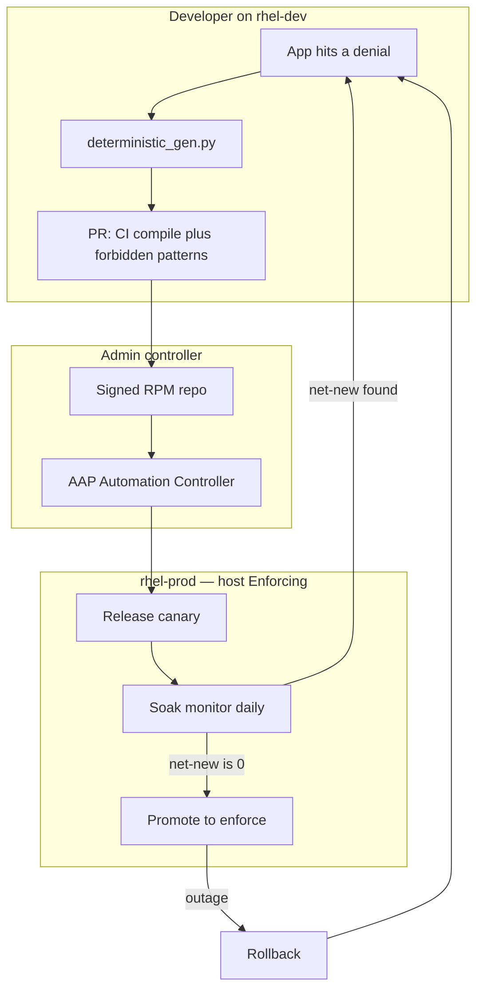

# SELinux Policy-as-Code

**Ship SELinux the same way you ship the application:** developers open a PR, CI compiles and rejects dangerous allows, admins publish a signed RPM, **Ansible Automation Platform (AAP)** canaries, soaks, and enforces. The host stays **Enforcing**. Policy is a versioned product — not a one-off `audit2allow` on a box.

`myapp` is a **reference app**. Training labs are optional ([docs/README.md](docs/README.md)).

| You are | Start here |
|---------|------------|
| **RHEL admin / SRE** | [Why this exists](#why-this-exists) → [docs/admin/RHEL_TWO_HOST.md](docs/admin/RHEL_TWO_HOST.md) → [docs/admin/ANSIBLE_OPERATIONS.md](docs/admin/ANSIBLE_OPERATIONS.md) |
| **Application developer** | [Developers](#developers) and [docs/developers/ONBOARDING.md](docs/developers/ONBOARDING.md) |
| **Offline check (any laptop)** | `make check` |

---

## Why this exists

SELinux is how RHEL actually confines an app. Turning it off (`setenforce 0`), flipping the whole OS to Permissive, or piping `audit2allow` into `semodule -i` on prod “unblocks” the service and **throws away the confinement**. Admins then own an unreproducible module that never went through review.

This repo is the other path: **policy-as-code for admins and developers together.**

| Without this tool | With this tool |
|-------------------|----------------|
| App team pastes AVCs into a ticket; admin writes `.te` by hand | Developer runs a **deterministic generator** on rhel-dev; humans merge |
| Bind ports and labels drift per environment | Ports live in the **committed manifest**; canary registers them with `seport` |
| Duplicate cron AVCs look like a failed soak | Soak gates **net-new** access vs installed policy (`sesearch`) |
| Prod is a git clone and a hope | **No git on prod** — signed RPMs + AAP playbooks only |
| Enforce is a Friday `semanage` | AAP **Promote to enforce** with a **change ticket** and an approval node |
| Outage → `setenforce 0` | AAP **Rollback** (domain permissive, optional RPM downgrade) → new PR |

**What you keep:** `getenforce` **Enforcing** at all times. Only the **app domain** is permissive during canary soak. That is the model a RHEL admin will accept.

---

## How this differs from Ed Qual’s enablement lab

I built this after looking at [Ed Qual’s automate-selinux](https://github.com/stoleas/automate-selinux) (AAP + Event-Driven Ansible + Orchestrator). That project is strong at **unblocking a host that is already failing** in production: collect AVCs, route, approve, apply a local fix (`fcontext` / port / boolean, or a live module). It is an **ops response** loop.

This repo **shifts policy creation left**. Developers generate policy from AVCs on rhel-dev, open a **PR**, CI and CODEOWNERS review it, admins ship a signed RPM, AAP **canaries**, **soaks** (net-new vs installed policy), then **enforces** with a change ticket. A denial after ship is another PR — not `semodule -i` on the box.

Those are complementary, not substitutes: his loop detects and routes; this loop authors and ships reviewed policy.

---

## Value

- **Developers own the allow list in git.** `.te` / `.fc` / `selinux_ports` are reviewed like application code. CI blocks `shadow_t`, wildcards, `bin_t` execute, and the rest of the forbidden set.
- **Admins own production mutation.** The only control plane is AAP (same YAML on a laptop until the project is imported). Execution nodes SSH in; they never clone this repo onto prod.
- **AAP is the promotion path, not an auto-fixer.** Workflows: **Release canary** → scheduled **Soak monitor** → **Promote to enforce** (Soak status → approval → Enforce). A denied file or port becomes a **PR**, not a click that patches the live host. ([docs/admin/DENIAL_RESPONSE.md](docs/admin/DENIAL_RESPONSE.md))
- **Soak is evidence, not a calendar sticker.** Daily net-new vs the installed module. Fail closed if `sesearch` is missing (`setools-console` is an RPM require).
- **Break-glass is still gated.** `force_enforce` defaults false and still needs `change_ticket`. Rollback does not require an API key.

---

## Shipping loop



**Release canary** installs the module and puts **only** `myapp_t` (or your domain) in the permissive list. **Soak monitor** is a schedule, not a fake wait node. **Promote to enforce** is Soak status → human approval → Enforce. Objects: [ansible/aap/](ansible/aap/).

```text
Dev      AVC → generator → PR (CI + CODEOWNERS)
Admin    compile_and_validate.sh → signed RPMs → internal yum/dnf
Prod     Release canary → Soak monitor → Promote to enforce
```

---

## Admins

AAP execution nodes SSH to two RHEL boxes ([docs/admin/RHEL_TWO_HOST.md](docs/admin/RHEL_TWO_HOST.md)). Install `selinux-policy-ops` + `<app>-selinux` from a **signed internal repo**. Compile image: set `SELINUX_BUILD_IMAGE` to an internal mirror ([docs/admin/COMPILE_IMAGE.md](docs/admin/COMPILE_IMAGE.md)).

```bash
# Inventories (gitignored)
bash scripts/setup_rhel_hosts.sh write --dev-host rhel-dev.example.com --prod-host rhel-prod.example.com
bash scripts/setup_rhel_hosts.sh ping
bash scripts/setup_rhel_hosts.sh doctor

# Package + publish (see packaging/internal.env.example)
bash packaging/build_rpms.sh
bash packaging/publish_internal.sh

# Same playbooks AAP workflows run
ansible-playbook -i ansible/inventory.production.yml ansible/deploy_canary.yml --limit canary
ansible-playbook -i ansible/inventory.production.yml ansible/soak_monitor.yml --limit canary   # schedule daily in AAP
ansible-playbook -i ansible/inventory.production.yml ansible/soak_status.yml --limit canary
ansible-playbook -i ansible/inventory.production.yml ansible/enforce_production.yml \
  -e change_ticket=CHG123
```

Rollback: `ansible-playbook -i ansible/inventory.production.yml ansible/emergency_rollback.yml --limit canary`

Playbooks: [ansible/README.md](ansible/README.md). AAP workflows: [ansible/aap/](ansible/aap/) and [docs/admin/ANSIBLE_OPERATIONS.md](docs/admin/ANSIBLE_OPERATIONS.md). Adoption: [docs/admin/ADOPTION_CHECKLIST.md](docs/admin/ADOPTION_CHECKLIST.md). Runbook: [docs/admin/PRODUCTION_READINESS.md](docs/admin/PRODUCTION_READINESS.md).

---

## Developers

On **rhel-dev** (repo checkout, SELinux Enforcing):

```bash
sudo bash scripts/setup_staging_env.sh          # reference app; skip for your own service
bash scripts/dev_generate_policy.sh --apply     # deterministic engine; optional --llm-summary
bash scripts/assemble_pr_body.sh
gh pr create --body-file policy_out/pr_body.md --label security --label selinux
```

The generator classifies the denial: **file** → `.fc` + `restorecon`; **port** → `selinux_ports` in the manifest; **boolean** → host `setsebool` (not in the RPM); **new allow** → `.te` under CI forbidden-patterns. It does not auto-edit production.

CI must pass `smoke-tests`, `app-manifest`, `forbidden-patterns`, `compile-policy`. CODEOWNERS (`@anurag-saran`) review `selinux/` and `ansible/`.

New app: `bash scripts/selinux_pac_adopt.sh init payments` — [docs/developers/ONBOARDING.md](docs/developers/ONBOARDING.md).

Ports stay in the committed manifest (`selinux_ports`). Probe host/IP is per inventory (`http_probe_host`).

---

## Layout

```text
config/       App manifests (bind ports, probes, domains)
selinux/      Policy source of truth (.te/.fc, policy_version.txt)
ansible/      selinux_pac role + aap/ Controller workflows
packaging/    selinux-policy-ops + <app>-selinux; publish_internal.sh
scripts/      setup_rhel_hosts.sh, compile, ops scripts (also in the ops RPM)
docs/admin/   RHEL + AAP runbooks
docs/developers/  Onboarding, generator, tests
```

---

## Safety

- Never `force_enforce` without a change ticket. Never copy `soak_min_days: 0` from `inventory.dev.yml` onto prod (enforce refuses it on the `production` group).
- If a file or port is denied after ship: [docs/admin/DENIAL_RESPONSE.md](docs/admin/DENIAL_RESPONSE.md) — PR + recanary, not live `semodule -i`.
- Optional LLM polishes `pr_summary.md` only. Legacy `--legacy-full-policy` is emergency/controller-only.
- Host CLI `apply_policy.sh` is **not** the control plane (skips AAP, RPMs, `serial: 1`).

Podman / `--use-vm` is a laptop **backup** when the RHEL boxes are not available: [docs/training/SELINUX_TRAINING_LAB.md](docs/training/SELINUX_TRAINING_LAB.md).
