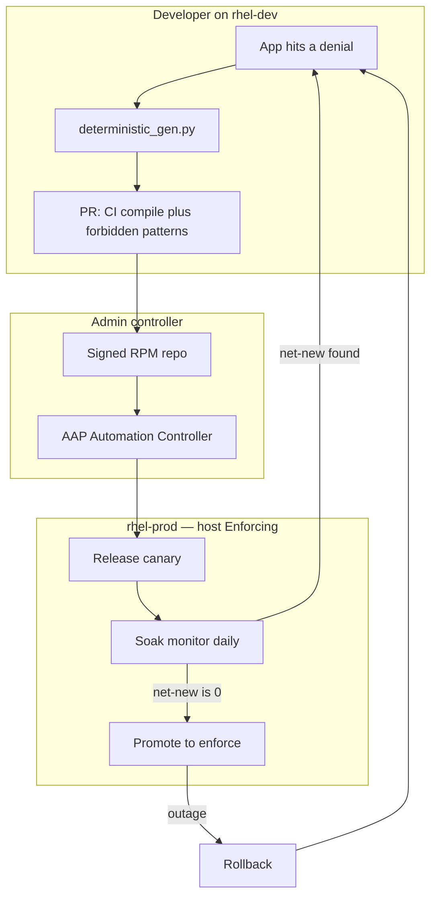

# SELinux PaC

**The RHEL admin tool for shipping SELinux policy as code.** Developers open a PR, CI compiles and rejects dangerous allows, admins publish a signed RPM, **Ansible Automation Platform (AAP)** canaries, soaks, and enforces. The host stays **Enforcing**. Policy is a versioned product — not a one-off `audit2allow` on a box.

`myapp` is the **reference application** that ships with the tool. Optional labs: [docs/README.md](docs/README.md).

| You are | Start here |
|---------|------------|
| **RHEL admin (customer env)** | [Admins: your environment](#admins-your-environment) |
| **Trying this on a Mac** | [Try it on a Mac](#try-it-on-a-mac) |
| **Application developer** | [Developers](#developers) and [docs/developers/ONBOARDING.md](docs/developers/ONBOARDING.md) |
| **Offline check (any laptop)** | `make check` |

---

## Why this exists

SELinux is how RHEL actually confines an app. Turning it off (`setenforce 0`), flipping the whole OS to Permissive, or piping `audit2allow` into `semodule -i` on prod “unblocks” the service and **throws away the confinement**. Admins then own an unreproducible module that never went through review.

This tool is the other path: **policy-as-code for admins and developers together.**

| Without this tool | With this tool |
|-------------------|----------------|
| App team pastes AVCs into a ticket; admin writes `.te` by hand | Developer runs a **deterministic generator** on rhel-dev; humans merge |
| Bind ports and labels drift per environment | Ports live in the **committed manifest**; canary registers them with `seport` |
| Duplicate cron AVCs look like a failed soak | Soak gates **net-new** access vs installed policy (`sesearch`) |
| Prod is a git clone and a hope | **No git on prod** — signed RPMs + AAP playbooks only |
| Enforce is a Friday `semanage` | AAP **Promote to enforce** with a **change ticket** and an approval node |
| Outage → `setenforce 0` | AAP **Rollback** (domain permissive, optional RPM downgrade) → new PR |

**What you keep:** `getenforce` **Enforcing** at all times. Only the **app domain** is permissive during canary soak. That is the model a RHEL admin will accept.

---

## How this differs from Ed Qual’s enablement lab

SELinux PaC was built after looking at [Ed Qual’s automate-selinux](https://github.com/stoleas/automate-selinux) (AAP + Event-Driven Ansible + Orchestrator). That project is strong at **unblocking a host that is already failing** in production: collect AVCs, route, approve, apply a local fix (`fcontext` / port / boolean, or a live module). It is an **ops response** loop.

**SELinux PaC shifts policy creation left.** Developers generate policy from AVCs on rhel-dev, open a **PR**, CI and CODEOWNERS review it, admins ship a signed RPM, AAP **canaries**, **soaks** (net-new vs installed policy), then **enforces** with a change ticket. A denial after ship is another PR — not `semodule -i` on the box.

Those are complementary, not substitutes: his loop detects and routes; this tool authors and ships reviewed policy.

---

## Value

- **Developers own the allow list in git.** `.te` / `.fc` / `selinux_ports` are reviewed like application code. CI blocks `shadow_t`, wildcards, `bin_t` execute, and the rest of the forbidden set.
- **Admins own production mutation.** The only control plane is AAP (same YAML on a laptop until the project is imported). Execution nodes SSH in; they never clone this repo onto prod.
- **AAP is the promotion path, not an auto-fixer.** Workflows: **Release canary** → scheduled **Soak monitor** → **Promote to enforce** (Soak status → approval → Enforce). A denied file or port becomes a **PR**, not a click that patches the live host. ([docs/admin/DENIAL_RESPONSE.md](docs/admin/DENIAL_RESPONSE.md))
- **Soak is evidence, not a calendar sticker.** Daily net-new vs the installed module. Fail closed if `sesearch` is missing (`setools-console` is an RPM require).
- **Break-glass is still gated.** `force_enforce` defaults false and still needs `change_ticket`. Rollback does not require an API key.

---

## Shipping loop



**Release canary** installs the module and puts **only** `myapp_t` (or your domain) in the permissive list. **Soak monitor** is a schedule, not a fake wait node. **Promote to enforce** is Soak status → human approval → Enforce. Objects: [ansible/aap/](ansible/aap/).

```text
Dev      AVC → generator → PR (CI + CODEOWNERS)
Admin    compile_and_validate.sh → signed RPMs → internal yum/dnf
Prod     Release canary → Soak monitor → Promote to enforce
```

---

## Admins: your environment

Fork the repo and wire it to **two RHEL boxes** plus **AAP**. There is no one-click datacenter installer; this is the customer path. Full checklist: [docs/admin/ADOPTION_CHECKLIST.md](docs/admin/ADOPTION_CHECKLIST.md). Doc index: [docs/README.md](docs/README.md).

| Follow | For |
|--------|-----|
| [docs/admin/ADOPTION_CHECKLIST.md](docs/admin/ADOPTION_CHECKLIST.md) | CODEOWNERS, CI, signed RPM repo, AAP objects |
| [docs/admin/RHEL_TWO_HOST.md](docs/admin/RHEL_TWO_HOST.md) | Dev box + prod box; **no git clone on prod** |
| [docs/admin/ANSIBLE_OPERATIONS.md](docs/admin/ANSIBLE_OPERATIONS.md) | Playbooks and extra-vars |
| [ansible/aap/README.md](ansible/aap/README.md) | Click-create job templates + **Release canary** / **Promote to enforce** |
| [docs/admin/PRODUCTION_READINESS.md](docs/admin/PRODUCTION_READINESS.md) | Soak, enforce, rollback |
| [docs/admin/DENIAL_RESPONSE.md](docs/admin/DENIAL_RESPONSE.md) | File/port denied after ship → PR, not live `semodule -i` |

**Scripts** (run from the controller — laptop or AAP execution node):

```bash
# write — create gitignored inventories (SSH host, soak days, RPM vs git checkout)
bash scripts/setup_rhel_hosts.sh write --dev-host rhel-dev.example.com --prod-host rhel-prod.example.com
# ping — Ansible SSH reachability to both boxes
bash scripts/setup_rhel_hosts.sh ping
# doctor — SELinux tools present (getenforce / ausearch / sesearch)
bash scripts/setup_rhel_hosts.sh doctor
# bootstrap — print (do not run) SSH steps for rhel-dev only
bash scripts/setup_rhel_hosts.sh bootstrap
# next app after myapp
bash scripts/selinux_pac_adopt.sh init myapp        # next app: payments — see ONBOARDING.md

# Package + publish (see packaging/internal.env.example)
bash packaging/build_rpms.sh                        # build selinux-policy-ops + myapp-selinux RPMs
bash packaging/publish_internal.sh                  # copy into your internal yum/dnf repo

# Same playbooks AAP workflows run
ansible-playbook -i ansible/inventory.production.yml ansible/deploy_canary.yml --limit canary
#   install module, myapp_t permissive, HTTP probes, start soak clock
ansible-playbook -i ansible/inventory.production.yml ansible/soak_monitor.yml --limit canary
#   schedule daily in AAP — fail if net-new AVCs vs installed policy
ansible-playbook -i ansible/inventory.production.yml ansible/soak_status.yml --limit canary
#   read-only: days elapsed, AVC counts, fail_closed
ansible-playbook -i ansible/inventory.production.yml ansible/enforce_production.yml \
  -e change_ticket=CHG123
#   soak gate then remove permissive; needs change_ticket
```

Rollback: `ansible-playbook -i ansible/inventory.production.yml ansible/emergency_rollback.yml --limit canary`

Install `selinux-policy-ops` + `<app>-selinux` from a **signed internal repo**. Compile policy on RHEL with `selinux-policy-devel`. Playbooks: [ansible/README.md](ansible/README.md).

---

## Try it on a Mac

macOS has **no SELinux**. The Mac is the **Ansible controller**; policy still runs on Linux.

**Preferred — two RHEL VMs (Apple Silicon: aarch64 Boot ISO in UTM), then the same admin scripts.** Run these from **repo root on the Mac** (the Ansible controller). They do **not** install SELinux on macOS.

| Command | What it does | Good sign |
|---------|----------------|-----------|
| `bash scripts/setup_rhel_hosts.sh write --dev-host 192.168.64.6 --prod-host 192.168.64.5` | Writes gitignored `ansible/inventory.dev.yml` and `ansible/inventory.production.yml` with those SSH IPs. Dev gets `soak_min_days: 0` (lab). Prod gets `soak_min_days: 7` and **no git clone** (`selinux_ops_from_package: true`). | Prints `Wrote …/inventory.dev.yml` and `…/inventory.production.yml` |
| `bash scripts/setup_rhel_hosts.sh ping` | Ansible `ping` module over SSH to both VMs (can the controller reach them?). | `SUCCESS` / `pong` for `rhel-dev` and `rhel-prod` |
| `bash scripts/setup_rhel_hosts.sh doctor` | On each VM (as sudo): `getenforce`, `ausearch`, `sesearch`. Prod also `rpm -q selinux-policy-ops`. | `Enforcing`; paths to `ausearch` and `sesearch`. Prod may say the ops RPM is not installed yet |
| `bash scripts/setup_rhel_hosts.sh bootstrap` | **Prints** the SSH/`dnf`/`setup_staging_env.sh` commands for **rhel-dev only**. It does not run them. | A block starting `=== Bootstrap the DEV RHEL box` |

Those IPs are this Mac’s UTM shared network (`rhel-dev` = `192.168.64.6`, `rhel-prod` = `192.168.64.5`). Re-check with `ping` if a VM was recreated.

**You are not done.** `bootstrap` only printed the next commands. Open **[docs/admin/RHEL_TWO_HOST.md](docs/admin/RHEL_TWO_HOST.md)** (plain-language, one computer at a time):

- [Words you will see](docs/admin/RHEL_TWO_HOST.md#words-you-will-see-plain-english)
- [Part 2 — Install the demo app on the dev VM](docs/admin/RHEL_TWO_HOST.md#part-2--install-the-demo-app-on-the-dev-vm)
- [Present this lab (three terminals)](docs/admin/RHEL_TWO_HOST.md#present-this-lab-three-terminals) — typewriter scripts for the Mac, rhel-dev, and rhel-prod

Lab enforce uses `soak_min_days: 0` on **dev only** — never copy that onto prod.

---

## Developers

On **rhel-dev** (repo checkout, SELinux Enforcing):

```bash
sudo bash scripts/setup_staging_env.sh          # reference app; skip for your own service
bash scripts/dev_generate_policy.sh --apply     # deterministic engine; optional --llm-summary
bash scripts/assemble_pr_body.sh
gh pr create --body-file policy_out/pr_body.md --label security --label selinux
```

The generator classifies the denial: **file** → `.fc` + `restorecon`; **port** → `selinux_ports` in the manifest; **boolean** → host `setsebool` (not in the RPM); **new allow** → `.te` under CI forbidden-patterns. It does not auto-edit production.

CI must pass `smoke-tests`, `app-manifest`, `forbidden-patterns`, `compile-policy`. CODEOWNERS (`@anurag-saran`) review `selinux/` and `ansible/`.

New app: `bash scripts/selinux_pac_adopt.sh init payments` — [docs/developers/ONBOARDING.md](docs/developers/ONBOARDING.md).

Ports stay in the committed manifest (`selinux_ports`). Probe host/IP is per inventory (`http_probe_host`).

---

## Layout

```text
config/       App manifests (bind ports, probes, domains)
selinux/      Policy source of truth (.te/.fc, policy_version.txt)
ansible/      selinux_pac role + aap/ Controller workflows
packaging/    selinux-policy-ops + <app>-selinux; publish_internal.sh
scripts/      setup_rhel_hosts.sh (admins), demo_e2e_*.sh (three-window lab talk track)
docs/admin/   Adoption, two-host, AAP, soak/enforce runbooks
docs/developers/  Onboarding, generator, tests
docs/training/    Optional labs (run on rhel-dev)
```

---

## Safety

- Never `force_enforce` without a change ticket. Never copy `soak_min_days: 0` from `inventory.dev.yml` onto prod (enforce refuses it on the `production` group).
- If a file or port is denied after ship: [docs/admin/DENIAL_RESPONSE.md](docs/admin/DENIAL_RESPONSE.md) — PR + recanary, not live `semodule -i`.
- Optional LLM polishes `pr_summary.md` only. Legacy `--legacy-full-policy` is emergency/controller-only.
- Host CLI `apply_policy.sh` is **not** the control plane (skips AAP, RPMs, `serial: 1`).
