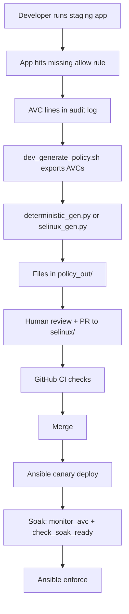

# Code walkthrough guide

This guide answers: **“What files are in this project, and how do they work together?”**

You do **not** need to know every script on day one. Read this in order, pause when something is new, and use the linked docs for deeper topics.

| Your goal | Start here |
|-----------|------------|
| Understand SELinux words (domain, AVC, `.te`) | [SELINUX_BASICS.md](SELINUX_BASICS.md) **first** (sections 1–7) |
| **Practice commands before the workshop** | **[SELINUX_TRAINING_LAB.md](SELINUX_TRAINING_LAB.md)** (10 labs, sample outputs) |
| See how this repo fits together | [What this project does](#what-this-project-does-in-plain-english) → [Story of one policy change](#story-of-one-policy-change) |
| Find a folder or file | [Directory map](#directory-map-what-each-folder-is-for) |
| Run the live workshop | [DEMO_GUIDE.md](DEMO_GUIDE.md) |
| Deploy to real servers | [PRODUCTION_READINESS.md](PRODUCTION_READINESS.md) |

**Time:** about 30–45 minutes if you read the basics doc first; 60+ minutes if you read both cover to cover.

**Doc map:** [docs/README.md](README.md) — reading order for all guides.

---

## Where to run commands (read this once)

| Environment | When to use it | Typical commands from this guide |
|-------------|----------------|----------------------------------|
| **Repo root on any OS** | Offline tests, Python CLI, reading git | `make check`, `python3 cli/deterministic_gen.py --explain …` |
| **Native Linux with SELinux** (RHEL, Fedora, Stream VM) | Staging, demo, soak, `semanage` | `sudo bash scripts/setup_staging_env.sh`, `curl 127.0.0.1:8888/…` |
| **Mac Terminal at repo root** | Podman only — drives a Linux VM | `bash scripts/fix_podman.sh`, `source …/env.sh`, `run_on_podman_vm.sh …` |
| **Inside Podman Machine VM** | Same as native Linux for labs/demo | `cd /home/core/selinux-demo`, `getenforce`, `sudo semanage …` |
| **Production / staging servers** | Ansible deploy lifecycle | Playbooks in `ansible/` — not your laptop unless inventory says so |

macOS step-by-step (host vs VM): [SELINUX_TRAINING_LAB.md — Running on macOS](SELINUX_TRAINING_LAB.md#running-on-macos).

**Repo root** = directory containing `scripts/` and `docs/` (after `git clone`).

---

## Words you will see in this repo

If any term is fuzzy, open [SELINUX_BASICS.md](SELINUX_BASICS.md). Quick reminders:

| Term | Plain English |
|------|----------------|
| **Policy** | Rules that say which labeled process may touch which labeled files, ports, etc. |
| **`.te` file** | Text file with **allow** rules and types (Type Enforcement). |
| **`.fc` file** | Maps paths like `/var/lib/myapp` to file **types** so `restorecon` labels disks correctly. |
| **`.pp` file** | Compiled policy **module** you install with `semodule -i`. |
| **AVC** | A log line: “this process tried to do X and policy said no.” |
| **Domain** | The SELinux type of a **running** process (e.g. `myapp_t`). |
| **Manifest** | YAML file listing app name, paths, HTTP test URLs, and domains — so scripts do not hardcode `myapp`. |
| **semanage** | Linux admin tool that changes SELinux’s **live** settings (per-domain permissive, port labels, booleans) — see [SELINUX_BASICS.md §7](SELINUX_BASICS.md) |
| **`policy_out/`** | Local scratch folder for generated files (not committed to git). |
| **`selinux/`** | The **real** policy source your team reviews in pull requests. |

---

## What this project does in plain English

This repository is a **demo plus tooling** for “shift-left” SELinux:

1. A small **Flask app** (`app/`) runs on a Linux host with SELinux on.
2. While the app domain is **permissive**, the kernel **logs** denials (AVCs) instead of blocking everything.
3. Scripts **collect** those logs and **generate** updates to `myapp.te` / `myapp.fc` (by rules engine or optional AI).
4. **CI** checks the change (dangerous patterns, compile, semantics, version numbers).
5. **Ansible** deploys a new module to servers in **canary** mode, waits through a **soak** period, then **enforces**.

You are not expected to memorize every bash script. Most days you touch **`app/`**, **`selinux/`**, **`config/*.manifest.yml`**, and **`scripts/dev_generate_policy.sh`**.

---

## Story of one policy change

Follow this narrative once; later sections add file names and detail.

**Step by step:**

1. **Staging** — `scripts/setup_staging_env.sh` (or Ansible) installs the app and puts `myapp_t` in permissive mode so you can collect denials safely.
2. **Trigger the app** — curl the demo URLs (or run `scripts/run_demo.sh`). Each URL is designed to exercise one kind of permission (files, ports, scripts, etc.). See [SELINUX_BASICS.md §9](SELINUX_BASICS.md) for the mapping.
3. **Export AVCs** — `scripts/dev_generate_policy.sh` calls `lib/avc_query.sh` with paths and domains from **`config/myapp.manifest.yml`** (not hardcoded `/opt/myapp` defaults).
4. **Generate policy** — Default engine is **`cli/deterministic_gen.py`** (offline, rule-based). Optional: **`cli/selinux_gen.py`** uses an LLM when `OPENAI_API_KEY` is set.
5. **Review** — Output lands in **`policy_out/`** (`.te`, `.fc`, `pr_summary.md`, `findings.json`). You compare to **`selinux/`** and open a PR.
6. **CI** — Workflow **`selinux-policy-ci.yml`** runs compile, forbidden-pattern checks, version consistency, blast-radius fixtures, etc.
7. **Deploy** — Admins use **`ansible/deploy_canary.yml`**, watch **`scripts/monitor_avc.sh`**, then **`check_soak_ready.sh`**, then **`enforce_production.yml`**.

**Golden rule:** committed policy lives in **`selinux/`**. **`policy_out/`** is disposable local output.

---

## Directory map — what each folder is for

Think of the repo in **layers**: app → policy source → generators → automation → deploy.

| Path | Beginner description |
|------|----------------------|
| [`app/`](../app/) | Demo web app + systemd unit files. Exists so SELinux has realistic traffic to log. |
| [`selinux/`](../selinux/) | **`myapp.te`**, **`myapp.fc`**, version file — what reviewers approve. Second app example: **`selinux/payments/`**. |
| [`config/`](../config/) | **`myapp.manifest.yml`** — app name, paths, ports, curl paths, soak file locations. |
| [`cli/`](../cli/) | Python tools: read AVC logs, classify denials, write policy snippets. |
| [`scripts/`](../scripts/) | Bash entry points: compile, demo, soak checks, PR body assembly. |
| [`scripts/lib/`](../scripts/lib/) | Shared code **sourced** by other scripts (not usually run alone). |
| [`ansible/`](../ansible/) | Playbooks that install `.pp`, permissive soak, enforce, rollback. |
| [`packaging/`](../packaging/) | RPM specs and container recipe for the compile toolchain. |
| [`docs/`](../docs/) | Guides (basics, testing, production, this file). |
| [`policy_out/`](../policy_out/) | Generated output on your machine (gitignored). |
| [`.github/workflows/`](../.github/workflows/) | CI and deploy automation on GitHub. |
| [`tests/fixtures/`](../tests/fixtures/) | Small policy snippets used to test the blast-radius classifier in CI. |

---

## Application layer (`app/`)

**Why it exists:** SELinux policy is written for **real behavior**. This Flask app is a safe, small stand-in for “our product on a server.”

| File | What it does (simply) |
|------|------------------------|
| **`app.py`** | Web server on port **8888** with six routes (home, save log, run script, rotate log, call backend, Unix socket). |
| **`backend_stub.py`** | Tiny service on **8889** + socket under `/run/myapp/` — second SELinux domain (`myapp_backend_t`). |
| **`myapp.service`**, **`myapp-backend.service`** | Tell systemd how to start the app and create state/log/run directories. |
| **`backup.sh`** | Script the `/run-script` route executes (bash-only on purpose). |

**Why six HTTP paths?** Each path tries to use a different resource (port, log file, script file, network, socket). When policy is incomplete, you get an AVC that points to the **missing allow rule**. **Workshop staging** runs [`scripts/lib/integration_probes.sh`](../scripts/lib/integration_probes.sh) (all HTTP paths in one pass; Act 1 previews **`policy_out/avc.log`**). **Deploy gates** use [`scripts/wait_for_endpoints.sh`](../scripts/wait_for_endpoints.sh) to curl those paths and confirm the process still runs as the right **domain**.

---

## Policy source (`selinux/`)

| File | What it is |
|------|------------|
| **`myapp.te`** | Human-readable rules: types, `allow` lines, and reusable **macros** from refpolicy. |
| **`myapp.fc`** | “This path on disk should have type X.” Used by `restorecon`. |
| **`policy_version.txt`** | Version number (must match the `policy_module(myapp, …)` line in `.te`; CI checks this). |
| **`stub/`** | Smaller module for early lab setups. |
| **`payments/`** | Example second application module (see [ONBOARDING_SECOND_APP.md](ONBOARDING_SECOND_APP.md)). |

**Review tip:** prefer **interface macros** (shared refpolicy helpers) over one-off allows copied from `audit2allow`. That matches what [`scripts/validate_forbidden_patterns.sh`](../scripts/validate_forbidden_patterns.sh) enforces in CI.

---

## Config and manifests (`config/`)

**Problem manifests solve:** scripts used to assume every app was named `myapp` and lived under `/opt/myapp`. That caused **wrong AVC filters** for other apps.

| File | Role |
|------|------|
| **`myapp.manifest.yml`** | Demo app: paths, HTTP endpoints, domains, soak marker paths. |
| **`payments.manifest.example.yml`** | Template for a second app. |
| **`README.md`** | Field descriptions. |

**Loader:** [`scripts/lib/app_manifest.py`](../scripts/lib/app_manifest.py)

- **`validate`** — checks required YAML keys.
- **`shell-export`** — prints variables bash scripts can `eval` (domains, path list for AVC filtering, HTTP port, etc.).
- **`resolve`** — finds manifest from `APP_MANIFEST` or `POLICY_APP`.

Scripts like **`monitor_avc.sh`** and **`export_app_avcs_to_file`** in **`lib/avc_query.sh`** require manifest-derived paths — they **fail loudly** if paths are missing instead of silently using myapp defaults.

---

## Python CLI (`cli/`) — turning AVC logs into policy edits

Two engines share the same **first steps**: read the log, merge duplicate lines, subtract permissions already in `.te`.

### Shared preprocessing — `avc_preprocess.py`

| Step | Plain English |
|------|----------------|
| Parse AVC lines | Extract who tried what (source type, target type, permission class). |
| Merge | Combine duplicate lines into one row with all permissions. |
| Subtract existing | Drop permissions already allowed in current `myapp.te`. |
| **Net-new** | What is left is what generation must address. |

### Default: `deterministic_gen.py` (offline)

No API key. For each net-new denial it assigns a **verdict** (fix file labeling, use a boolean, add a safe allow via sepolgen, refuse dangerous allows, etc.) and writes:

- Updated **`policy_out/myapp.te`** / **`.fc`**
- **`findings.json`** — machine-readable record of each decision
- **`pr_summary.md`** — text for humans

Run golden tests: **`bash scripts/run_deterministic_fixtures.sh`**. Payments must not leak `myapp` strings: **`bash scripts/run_deterministic_payments_check.sh`**.

Details: [DETERMINISTIC_POLICY.md](DETERMINISTIC_POLICY.md).

### Optional: `selinux_gen.py` (LLM)

Same AVC preprocessing, then sends a structured prompt (`prompt_templates.py`) to an OpenAI-compatible API. Requires **`OPENAI_API_KEY`**. Still runs validation similar to CI.

### Other CLI modules (short)

| Module | Role |
|--------|------|
| **`fc_labeling.py`** | Detect labeling drift vs new `.fc` lines. |
| **`policy_rules.py`** | Shared “forbidden target” lists for deterministic mode. |
| **`verify_avc_coverage.py`** | Checks generated policy covers the exported AVC set. |
| **`boolean_hints.yml`** (in `config/`) | Curated hints when a **setsebool** is the right fix. |

---

## Shell scripts (`scripts/`) — what to run when

Most scripts expect your shell’s **current directory** to be the **repo root** unless the doc says otherwise. Staging and demo scripts need **Linux + SELinux** (native or Podman VM). Compile scripts use **Podman** on Mac or Linux when the Stream 9 tool image is pulled.

### Day-to-day developer commands

| Script | When you use it |
|--------|------------------|
| **`dev_generate_policy.sh`** | Main command: export AVCs → generate → diff → optional copy into `selinux/`. |
| **`assemble_pr_body.sh`** | Builds GitHub PR description from template + summary + optional rule diff. |
| **`setup_staging_env.sh`** | Prepare a Linux host for the demo (root). |
| **`compile_and_validate.sh`** | Compile `.te`/`.fc` to `.pp` and run basic checks. |

**Environment tips:**

- **`POLICY_ENGINE=deterministic`** (default) or **`llm`**
- **`APP_MANIFEST`** / **`POLICY_APP`** — pick which manifest drives paths and names
- **`--use-vm`** on macOS — export AVCs from a Podman VM with SELinux

### Safety gates (soak and production)

| Script | Plain English |
|--------|----------------|
| **`monitor_avc.sh`** | “How many denials since canary deploy?” Needs **`--manifest`** or explicit domain + paths. |
| **`check_soak_ready.sh`** | “Has enough time passed, are AVCs low enough, did deploy report pass?” |
| **`collect_soak_facts.sh`** | JSON facts for Ansible (same ideas as soak check). |
| **`post_deploy_report.sh`** | Writes deploy report JSON after endpoints are exercised. |
| **`verify_file_contexts.sh`** | Compare on-disk labels to `.fc` before restart. |

### Compile toolchain (Podman on Mac or CI)

| Script / lib | Role |
|--------------|------|
| **`lib/selinux_build_image.sh`** | **Single** `ensure_selinux_build_image()` — optional Hub pull, then local build. |
| **`lib/build_image.sh`** | Image constants and local `podman build` helper only (no duplicate ensure). |
| **`lib/compile_policy.sh`** | Compile module natively or inside the Stream 9 tool container. |
| **`build_selinux_compile_image.sh`** | Force rebuild the compile image. |

See [DOCKER_HUB_COMPILE_IMAGE.md](DOCKER_HUB_COMPILE_IMAGE.md) for Mac Podman notes.

### CI-heavy scripts (you may read, rarely run locally)

| Script | Why it exists |
|--------|----------------|
| **`validate_forbidden_patterns.sh`** | Block wildcards and risky allows in `.te`. |
| **`validate_policy_semantics.sh`** | After compile, probe policy in Podman (e.g. no shadow read). |
| **`validate_version_consistency.sh`** | Version file matches `.te` and packaging. |
| **`classify_policy_blast_radius.sh`** | Suggest soak length from how risky new allows are. |
| **`lib/policy_module_diff.sh`** | Markdown diff of allow rules between two module versions (for PR comments). |
| **`smoke_test.py`** | Fast regression suite on Ubuntu CI. |
| **`run_e2e_tests.sh`** | Broader integration driver. |

### Demo and VM helpers

| Script | Role |
|--------|------|
| **`run_training_lab.sh`**, **`run_demo_prep.sh`** | Guided lab / demo prep talk track (Lab 7 uses staged probes). |
| **`demo_present.sh`**, **`run_demo.sh`** | Workshop flows (Act 1 staged integration). |
| **`lib/integration_probes.sh`** | All workshop curls in one pass; Act 1 shows **`avc.log`**. |
| **`run_on_podman_vm.sh`** | Sync project to Podman Machine, **`trigger`** (staged probes), export AVCs with manifest filters. |

---

## Ansible (`ansible/`)

Playbooks are short; behavior lives in the **`myapp_selinux`** role.

| Playbook | Phase |
|----------|--------|
| **`deploy_canary.yml`** | Install module, permissive domain, smoke endpoints, start soak clock. |
| **`enforce_production.yml`** | Soak gates passed → enforcing mode. |
| **`emergency_rollback.yml`** | Break-glass rollback steps. |
| **`reset_host_state.yml`** | Clean lab state. |

**Canary (simplified):** validate artifact → optional `semodule -DB` → register ports → permissive domain → install `.pp` → `restorecon` → restart services → write marker + report.

**Enforce (simplified):** verify soak facts → remove permissive → rebuild policy store → smoke again.

Inventory examples: **`inventory.staging.example.yml`**, **`inventory.production.example.yml`**.

---

## Packaging (`packaging/`)

| Artifact | Purpose |
|----------|---------|
| **`myapp-selinux.spec`** | RPM that ships the compiled module for servers. |
| **`selinux-policy-ops.spec`** | RPM of operational scripts (`monitor_avc.sh`, etc.) for hosts without a git checkout. |
| **`Containerfile.selinux-build`** | CentOS Stream 9 image with `selinux-policy-devel` for fast compiles. |

---

## GitHub Actions (`.github/workflows/`)

| Workflow | Triggers | What it protects |
|----------|----------|------------------|
| **`selinux-policy-ci.yml`** | Pull requests | Smoke tests, compile, forbidden patterns, version drift, blast-radius fixtures, payments generator leak check, policy diff comment, etc. |
| **`selinux-staging-canary.yml`** | Push to main | Staging deploy smoke. |
| **`selinux-deploy.yml`** | Manual | Admin canary / enforce / rollback. |

PR checklist template: [`.github/PULL_REQUEST_TEMPLATE/selinux_policy_review.md`](../.github/PULL_REQUEST_TEMPLATE/selinux_policy_review.md).

---

## Tests (`tests/`)

**Blast-radius fixtures** under **`tests/fixtures/blast_radius/`** — tiny `.te` changes with expected JSON (tier, soak days, fail-closed). CI ensures the classifier does not silently shorten soak time on errors.

**Deterministic golden AVCs** live under **`docs/examples/fixtures/deterministic/`** (contiguous **`01`–`11`**; every verdict type has at least one case).

---

## Suggested path for new contributors

1. Read [SELINUX_BASICS.md](SELINUX_BASICS.md) sections **1–7** (labels, `.te`/`.fc`, permissive soak idea).
2. Complete [SELINUX_TRAINING_LAB.md](SELINUX_TRAINING_LAB.md) labs **1–7** on a SELinux VM (commands + checkpoints).
3. Skim [README.md](../README.md) architecture diagram.
4. Open **`config/myapp.manifest.yml`** and **`app/app.py`** — match each HTTP path to a permission story.
5. Trace one AVC through **`cli/avc_preprocess.py`**, then try **`bash scripts/dev_generate_policy.sh --skip-export`** with a saved **`policy_out/avc.log`**.
6. When ready for ops flow: [PRODUCTION_READINESS.md](PRODUCTION_READINESS.md) + **`check_soak_ready.sh`**.

---

## Quick reference — algorithms in one line each

| Idea | One-line explanation |
|------|----------------------|
| AVC merge | Group log lines by source + target + class; union permissions. |
| Net-new | Permissions in AVC minus permissions already in `.te`. |
| Policy diff for PRs | Compile old and new module → compare `sesearch` allow lines. |
| Blast radius | Classify each **new** allow as low/medium/high risk → suggested soak days; errors → stay strict (7 days). |
| Soak gate | Enough days since canary + few enough AVCs + deploy report OK. |
| Version SSOT | `policy_version.txt` must match `policy_module()` in `.te`. |
| Manifest identity | App name, domains, and AVC path filters come from YAML — not silent `myapp` defaults. |

---

## Other docs in `docs/`

| Doc | Best for |
|-----|----------|
| [README.md](README.md) | **Start here** — doc map and reading order |
| [SELINUX_BASICS.md](SELINUX_BASICS.md) | First-time SELinux readers |
| [SELINUX_TRAINING_LAB.md](SELINUX_TRAINING_LAB.md) | Hands-on labs before the workshop |
| [TESTING.md](TESTING.md) | CI jobs and local test commands |
| [DEMO_GUIDE.md](DEMO_GUIDE.md) | Presenting the workshop |
| [DETERMINISTIC_POLICY.md](DETERMINISTIC_POLICY.md) | Offline generator and fixtures |
| [PRODUCTION_READINESS.md](PRODUCTION_READINESS.md) | Admins rolling out canary → enforce |
| [ONBOARDING_SECOND_APP.md](ONBOARDING_SECOND_APP.md) | Adding `payments` or your own app name |

If this guide disagrees with the code, **trust the repository** and send a PR to update the doc.
