# Code walkthrough guide

This document is for **new contributors** who want to understand what lives where in this repository, how the pieces connect, and the **logic behind the main scripts and Python modules**. Read it alongside [SELINUX_BASICS.md](SELINUX_BASICS.md) (concepts) and [DEMO_GUIDE.md](DEMO_GUIDE.md) (workshop order).

---

## How to use this guide

| If you want to… | Start here |
|-----------------|------------|
| See the whole pipeline in one picture | [End-to-end flow](#end-to-end-flow) |
| Find a file by name | [Directory map](#directory-map) |
| Understand AI policy generation | [CLI (`cli/`)](#cli-policy-generation) |
| Understand deploy and soak | [Ansible (`ansible/`)](#ansible-deployment) |
| Understand CI gates | [GitHub Actions](#github-workflows) |

**Convention:** *Source of truth* for policy text is **`selinux/`**. *Local build output* goes to **`policy_out/`** (gitignored). Production hosts usually get a **compiled `.pp` from an RPM**, not a git checkout.

---

## End-to-end flow

```mermaid
flowchart LR
  subgraph dev [App team]
    A[app/ Flask probes] --> B[staging permissive myapp_t]
    B --> C[audit.log AVCs]
    C --> D[dev_generate_policy.sh]
    D --> E[cli/selinux_gen.py or deterministic_gen.py]
    E --> F[policy_out/ .te .fc pr_summary]
    F --> G[assemble_pr_body.sh]
    G --> H[PR to selinux/]
  end
  subgraph ci [CI on PR]
    H --> I[forbidden-patterns compile semantics blast-radius version-consistency]
    I --> J[policy-diff-comment]
  end
  subgraph ops [Admin]
    J --> K[merge]
    K --> L[deploy_canary.yml]
    L --> M[soak + monitor_avc]
    M --> N[enforce_production.yml]
  end
```

**Idea in one sentence:** the app **provokes** denials on purpose; the CLI **turns denials into policy diffs**; shell scripts **validate and explain** those diffs; Ansible **installs and soaks** safely before enforce.

---

## Directory map

| Path | Role |
|------|------|
| [`app/`](../app/) | Demo Flask app, backend stub, systemd units — integration test surface |
| [`selinux/`](../selinux/) | Version-controlled Type Enforcement (`.te`) and file contexts (`.fc`) |
| [`cli/`](../cli/) | Python: AVC parsing, LLM or deterministic policy generation |
| [`config/`](../config/) | YAML **app manifests** (paths, HTTP probes, domains) |
| [`scripts/`](../scripts/) | Bash/Python automation: compile, demo, soak gates, PR assembly |
| [`scripts/lib/`](../scripts/lib/) | Shared libraries sourced by other scripts |
| [`scripts/ci/`](../scripts/ci/) | GitHub Actions helpers (PR comments) |
| [`ansible/`](../ansible/) | Playbooks + `myapp_selinux` role (canary, enforce, rollback) |
| [`packaging/`](../packaging/) | RPM specfiles and `build_rpms.sh` |
| [`tests/fixtures/`](../tests/fixtures/) | Deterministic inputs for blast-radius classifier CI |
| [`docs/`](../docs/) | Human docs (this file, testing, production readiness) |
| [`policy_out/`](../policy_out/) | **Generated** `.pp`, AVC exports, PR markdown (not committed) |
| [`.github/workflows/`](../.github/workflows/) | CI and deploy workflows |
| [`Containerfile`](../Containerfile) | Optional container image for dev/demo |
| [`generator/`](../generator/) | Thin wrapper pointing at the CLI (legacy entry) |

---

## Application layer (`app/`)

These files exist so SELinux has **realistic workloads** to deny or allow. Each HTTP route maps to a permission class admins care about.

| File | Purpose |
|------|---------|
| **`app.py`** | Flask app on port **8888**. Six routes exercise bind, file I/O, script exec, log rotation, TCP client, and Unix socket client. **`selinux_status()`** reads `getenforce`, permissive list, and optional deploy report — returned on `GET /` for debugging. |
| **`backend_stub.py`** | Minimal HTTP on **8889** and Unix socket under **`/run/myapp/notify.sock`**. Runs in **`myapp_backend_t`** when systemd is configured correctly. |
| **`myapp.service` / `myapp-backend.service`** | systemd units with `StateDirectory`, `LogsDirectory`, `RuntimeDirectory` so paths exist with correct ownership before the app starts. |
| **`backup.sh`** | Invoked by `/run-script`. Uses **bash builtins only** so policy never needs forbidden `bin_t:file execute`. |
| **`logrotate.d/myapp`** | Example logrotate config (real logrotate runs as other domains; demo uses `/rotate-log` instead). |

### Logic highlight: why six endpoints?

Each route is a **controlled experiment**:

1. **`/`** — `name_bind` on a dedicated port type (`myapp_port_t`).
2. **`/save-log`** — append/create under `/var/log/myapp` (`myapp_log_t`) plus directory traversal.
3. **`/run-script`** — `execute_no_trans` on a labeled script type.
4. **`/rotate-log`** — rename/create (logrotate-like) on app log types.
5. **`/probe-backend`** — outbound TCP + socket options (`myapp_backend_port_t`).
6. **`/notify-socket`** — Unix `connectto` to backend domain.

[`scripts/wait_for_endpoints.sh`](../scripts/wait_for_endpoints.sh) curls these paths and optionally verifies each service’s **MainPID SELinux context** matches the manifest — catching “HTTP 200 but wrong domain” bugs.

---

## Policy source (`selinux/`)

| File | Purpose |
|------|---------|
| **`myapp.te`** | Type Enforcement: types, attributes, `allow` rules, refpolicy **interfaces** (`init_daemon_domain`, `logging_log_filetrans`, etc.). Starts with **`policy_module(myapp, X.Y.Z)`**. |
| **`myapp.fc`** | File context mappings: which paths get which types at `restorecon`. |
| **`policy_version.txt`** | **Single source of truth** for SemVer (must match `policy_module()` line; CI enforces). |
| **`stub/`** | Smaller module for early staging / FCOS overlay paths. |
| **`myapp_canary.*`** | Optional canary-specific module variants used in some flows. |
| **`myapp.pp`** | May exist locally after compile; CI builds `.pp` as artifact — not required in git. |

### Logic highlight: interfaces vs raw allows

Good policy in this repo prefers **refpolicy macros** over audit2allow-style one-offs. That keeps reviews readable and aligns with [`validate_forbidden_patterns.sh`](../scripts/validate_forbidden_patterns.sh) (no wildcards, no `shadow_t`, etc.).

---

## Config (`config/`)

| File | Purpose |
|------|---------|
| **`myapp.manifest.yml`** | Demo manifest: install paths, HTTP port, endpoint list, systemd units, SELinux domains, soak marker paths. |
| **`payments.manifest.example.yml`** | Template for onboarding another app name. |
| **`README.md`** | Schema table and inventory examples. |

### Logic highlight: [`scripts/lib/app_manifest.py`](../scripts/lib/app_manifest.py)

Python module that:

- Validates required keys.
- Exports shell-friendly variables (`shell-export` subcommand).
- Resolves default manifest path from `POLICY_APP` / `APP_MANIFEST`.

Manifest-driven scripts share one definition of “what to probe” instead of hardcoding myapp paths everywhere.

---

## CLI — policy generation (`cli/`)

### `selinux_gen.py` — main LLM pipeline

**Entry point** for AI-assisted updates. High-level algorithm:

1. **Collect AVCs** — from a file or `ausearch` on the host (`parse_avc_line`).
2. **Preprocess** — delegate to `avc_preprocess.py` (merge, subtract existing allows).
3. **Prompt** — `prompt_templates.py` builds system + user messages with existing `.te`, net-new needs, and interface allowlists.
4. **Call LLM** — returns JSON with updated `.te` / `.fc` fragments and **`pr_summary.md`** sections.
5. **Validate** — regex checks mirror CI forbidden patterns; required PR summary headings.
6. **Version** — read/bump `policy_version.txt`; sync `policy_module()` version.
7. **Optional compile/install** — invoke refpolicy Makefile or subprocess helpers.

Key data structures:

- **`AvcEntry`** — one parsed denial line (subject, object, class, permissions).
- **Forbidden patterns** — same spirit as shell CI (wildcards, `bin_t` execute, privileged types).

### `avc_preprocess.py` — shrink LLM input

| Function | Algorithm |
|----------|-----------|
| `merge_avc_entries` | Group AVC lines by `(src_type, tgt_type, class)`; **union** permission sets. |
| `parse_existing_allows` | Regex-scan current `.te` for `allow src tgt:class { perms };`. |
| `subtract_covered` | For each merged need, compute `net_new = avc_perms - existing_perms`. Only net-new goes to the LLM. |
| `build_avc_summary_text` | Human-readable summary for prompts and logs. |

This prevents the model from re-adding allows you already have and reduces token cost.

### `prompt_templates.py`

Static **system prompt** encodes org rules: FHS paths, banned types, preferred interfaces, output JSON shape. **`build_user_prompt`** injects AVC summary + existing policy excerpt.

### `policy_rules.py`

Shared **deterministic** verdict constants and pattern tables (`FORBIDDEN_TARGET_TYPES`, `PATTERN_MACROS` mapping permission sets to refpolicy macro names). Keeps deterministic generation aligned with CI philosophy.

### `deterministic_gen.py` — offline generation

Same AVC preprocess path, but instead of an LLM:

1. Classify each `AccessNeed` with house rules (`Finding`: verdict + rendered TE snippet).
2. Optionally call **sepolgen** on RHEL if installed.
3. Emit `.te`/`.fc` updates and **`findings.json`** for auditing.

Use when `OPENAI_API_KEY` is unavailable (`--engine deterministic` in `dev_generate_policy.sh`).

### `verify_avc_coverage.py`

Checks that merged AVC needs are **addressed** in generated policy (used in dev workflow / tests).

### `requirements.txt`

Python deps (`openai`, `pyyaml`, etc.) for the CLI.

---

## Shell orchestration (`scripts/`)

### Developer workflow

| Script | What it does | Core logic |
|--------|----------------|------------|
| **`dev_generate_policy.sh`** | One command: export AVCs → run engine → optional `--apply` to `selinux/` → assemble PR body → optional `--open-pr`. | Branches on `--use-vm` (Podman), `--engine`, `--skip-export`. **`promote_to_selinux()`** copies `policy_out` → `selinux` and fixes version via regex on `policy_module()`. |
| **`assemble_pr_body.sh`** | Fills PR template placeholders. | 1) Optional **`policy_module_diff.sh --from-merge-base`** → markdown delta. 2) Python replaces `<!-- AUTO:* -->` markers with version, summary, AVC excerpt, diff. **Fails closed** if diff fails (unless `--skip-policy-diff`). |
| **`setup_staging_env.sh`** | Installs app, stub policy, permissive domain, systemd units. | Prepares host for integration tests and AVC collection. |
| **`selinux-gen`** | Thin wrapper → `dev_generate_policy.sh --help` / forwards args. | Convenience alias. |

### Compile and validate

| Script | What it does | Core logic |
|--------|----------------|------------|
| **`compile_and_validate.sh`** | Wrapper: compile module + basic checks. | Sources **`lib/compile_policy.sh`**. |
| **`lib/compile_policy.sh`** | **`compile_policy_module`**: refpolicy Makefile **natively or in Podman**. Uses prebuilt **`selinux-demo/selinux-build:stream9`** when present (`ensure_selinux_build_image` auto-builds once). Slow fallback: `dnf` in plain CentOS image. |
| **`build_selinux_compile_image.sh`** | Builds [`packaging/Containerfile.selinux-build`](../packaging/Containerfile.selinux-build) (devel + setools + targeted policy). |
| **`compile_module.sh`** | CLI wrapper used by **`selinux_gen.py`** and local compiles. |
| **`validate_forbidden_patterns.sh`** | Fast grep + Python checks on `.te`. | Fails on wildcards, `bin_t` execute, `require { type myapp_* }`, privileged targets, broad `var_t` write. |
| **`validate_policy_semantics.sh`** | Installs `.pp` in **Podman only**, runs **`sesearch --direct`** probes (no shadow read, no foreign entrypoint). | Ensures compiled policy **means** what reviewers think — not just syntax. |
| **`validate_version_consistency.sh`** | Compares `policy_version.txt`, `policy_module()` in `.te`, and RPM spec wiring. | Uses **`lib/version.sh`**. |
| **`verify_file_contexts.sh`** | `matchpathcon` / `restorecon -n` dry-run on app paths. | Catches `.fc` drift before restart. |
| **`verify_pp_drift.sh`** | Ensures committed `.pp` matches sources (when present). | Optional drift guard. |

### Policy diff and blast radius (soak tiering)

| Script | What it does | Core logic |
|--------|----------------|------------|
| **`lib/policy_module_diff.sh`** | Diff **allow rules** for app domains between two module versions. | **Why not `sediff` on `.pp`?** Module packages are not full kernel policies on EL9. Algorithm: compile base + candidate → Podman → **`semodule -i`** each → **`sesearch --allow`** per domain → sort → **`comm`** added/removed lines → markdown. **`--from-merge-base`** extracts base `.te`/`.fc` from git merge-base with `origin/main`. |
| **`lib/policy_module_sesearch.sh`** | Helper run inside container: dump allows for listed domains from **installed** module store. | Uses policy file as positional arg (not `sesearch -p`, which is permissions on EL9). |
| **`classify_policy_blast_radius.sh`** | JSON tier recommendation for soak length. | Compile inputs → Podman → **`blast_radius_collect.sh`** (rule diff + type rules) → **`blast_radius_classify.py`**. |
| **`lib/blast_radius_collect.sh`** | Install base then candidate sequentially; diff sesearch output. | Produces `added_rules.txt` for classifier. |
| **`lib/blast_radius_classify.py`** | Map each added rule to tier **low / medium / high** → soak days **1 / 3 / 7**. | **`max(tier)`** wins. Target in `BASE_TARGET_TYPES` or entrypoint → **high**. Target `myapp_*` → **low**. Else **medium**. Unparseable line → **fail_closed** (stay at 7 days). |
| **`run_blast_radius_fixtures.sh`** | CI: run classifier against **`tests/fixtures/blast_radius/`** | Each case has `cand.te` + `expected.json`; corrupt input must yield `fail_closed: true`. |
| **`check_soak_ready.sh`** | Exit 0 only when soak gate passes. | Checks: marker file age ≥ `min_days`, AVC count since marker ≤ max, deploy report JSON shows endpoints + **domain_context_verified**. Optional **`--auto-tier`**: run classifier; on error use configured **`min_days`** (never shorten on failure). |
| **`collect_soak_facts.sh`** | Emit JSON facts for Ansible (no classifier). | Same counters as soak check; role compares on controller. |
| **`monitor_avc.sh`** | Daily soak helper: count AVCs for domain since timestamp. | Uses **`lib/avc_query.sh`**. |

### Deploy helpers (non-Ansible)

| Script | Purpose |
|--------|---------|
| **`apply_policy.sh`** | Manual `semodule -i` + restorecon + restart pattern. |
| **`post_deploy_report.sh`** | Writes `/var/lib/myapp/selinux_deploy_report.json` after smoke. |
| **`wait_for_endpoints.sh`** | Retry loop: systemd active + curl endpoints + domain check. |

### Demo and Podman

| Script | Purpose |
|--------|---------|
| **`demo_present.sh` / `run_demo.sh`** | Workshop presenter; can use **`lib/stage_skip_ai_fixture.sh`** for offline `--skip-ai`. |
| **`run_on_podman_vm.sh` / `podman_run.sh` / `podman_build.sh` / `fix_podman.sh`** | macOS/Linux Podman VM lifecycle for SELinux-capable testing. |
| **`container_entrypoint.sh`** | Entrypoint for demo container. |

### Other validation

| Script | Purpose |
|--------|---------|
| **`validate_app_manifest.sh`** | Shell wrapper → `app_manifest.py validate`. |
| **`validate_rpm_ops_parity.sh`** | Ops RPM file list matches repo scripts. |
| **`smoke_test.py`** | CI on Ubuntu: unit tests for AVC parsing, prompts, manifest, assemble (with `--skip-policy-diff`), version consistency, classifier fail-closed JSON. |
| **`run_e2e_tests.sh`** | Higher-level integration driver. |

### CI helper

| Script | Purpose |
|--------|---------|
| **`ci/post_pr_policy_diff_comment.sh`** | On PR: run diff, upsert GitHub comment with marker `<!-- selinux-policy-module-diff -->`. |

### Shared shell libraries (`scripts/lib/`)

| File | Role |
|------|------|
| **`version.sh`** | `policy_version()` reads txt; `policy_module_version_from_te()` parses `.te`. |
| **`avc_query.sh`** | `count_domain_events_since` via **`ausearch --input-logs`** (includes rotated logs). |
| **`app_manifest.py`** | Manifest validate / resolve / export. |
| **`vm_ready.sh`** | Podman machine readiness checks. |

---

## Ansible deployment (`ansible/`)

Playbooks are **thin**; logic lives in the **`myapp_selinux`** role.

| Playbook | Phase |
|----------|--------|
| **`deploy_canary.yml`** | Sets `myapp_selinux_phase: canary` |
| **`enforce_production.yml`** | Sets phase `enforce` |
| **`emergency_rollback.yml`** | Phase `rollback` |
| **`reset_host_state.yml`** | Phase `reset_host` |
| **`generate_emergency_patch.yml`** | Optional LLM patch during incident |

### Role flow (`roles/myapp_selinux/`)

**`tasks/main.yml`**

1. **`lookup('file', policy_artifact_dir/selinux/policy_version.txt')`** → `policy_version` fact (no hardcoded inventory version).
2. **`import_tasks: {{ myapp_selinux_phase }}.yml`**

**`tasks/canary.yml`** (high level)

1. Validate `policy_pp_src` or RPM path.
2. **`semodule -DB`** — surface hidden denials during soak (host-wide; restored later).
3. Register ports with **`seport`**.
4. **`selinux_permissive`** for app domain only.
5. Copy/install `.pp`, **`restorecon`**, restart systemd, run **`wait_for_endpoints.sh`**, write soak marker + deploy report.
6. Optional AVC count gate (`canary_max_avc`).

**`tasks/enforce.yml`**

1. Run soak gate via **`collect_soak_facts.sh`** + assert min days / AVC / report.
2. Remove permissive domain, **`semodule -B`**, re-smoke endpoints; block/rescue returns permissive on failure.

**`tasks/rollback.yml`**

Permissive relief, optional **`dnf downgrade`** via `rollback_dnf_version`, AVC export, marker reset.

**`defaults/main.yml`**

Paths, soak thresholds, feature flags (`selinux_ops_from_package`, etc.).

Inventories (`inventory.*.example.yml`) show lab vs production variable patterns.

---

## Packaging (`packaging/`)

| File | Purpose |
|------|---------|
| **`build_rpms.sh`** | Reads version from **`version.sh`**, runs `rpmbuild` with `modver` define. |
| **`myapp-selinux.spec`** | Packages `.pp`, `%selinux_modules_install`, relabel macros, `%post` port registration. **`Version: %{modver}`** — not hardcoded. |
| **`selinux-policy-ops.spec`** | Ships operational scripts to `/usr/libexec` for production hosts without git. |

---

## GitHub workflows (`.github/workflows/`)

| Workflow | When | Main jobs |
|----------|------|-----------|
| **`selinux-policy-ci.yml`** | PR / push | `smoke`, `app-manifest`, `forbidden-patterns`, **`version-consistency`**, **`blast-radius`**, `compile`, `policy-semantics`, **`policy-diff-comment`**, `ansible-lint`, etc. |
| **`selinux-staging-canary.yml`** | Merge to main | Self-hosted staging canary + endpoint smoke. |
| **`selinux-deploy.yml`** | Manual dispatch | Admin canary / enforce / rollback on environments. |

PR template [`.github/PULL_REQUEST_TEMPLATE/selinux_policy_review.md`](../.github/PULL_REQUEST_TEMPLATE/selinux_policy_review.md) defines admin checklist; **`assemble_pr_body.sh`** fills **`<!-- AUTO:SEDIFF -->`** with merge-base rule delta.

---

## Tests (`tests/`)

| Path | Purpose |
|------|---------|
| **`fixtures/blast_radius/_common/`** | Shared base module for fixture compiles. |
| **`fixtures/blast_radius/*/cand.te`** | Candidate module tweak for one scenario. |
| **`fixtures/blast_radius/*/expected.json`** | Expected `tier`, `min_days`, `fail_closed` from classifier. |

These fixtures **lock in** soak tier logic — change classifier only with fixture updates.

---

## Docs and examples (`docs/`)

| Doc | Audience |
|-----|----------|
| **[SELINUX_BASICS.md](SELINUX_BASICS.md)** | SELinux vocabulary and demo endpoint mapping |
| **[TESTING.md](TESTING.md)** | Test layers and CI job table |
| **[PRODUCTION_READINESS.md](PRODUCTION_READINESS.md)** | Admin phases, soak, enforce gates |
| **[SELINUX_BEST_PRACTICES.md](SELINUX_BEST_PRACTICES.md)** | Do/don’t for policy authors |
| **[DEMO_GUIDE.md](DEMO_GUIDE.md)** | Live presentation script |
| **[DETERMINISTIC_POLICY.md](DETERMINISTIC_POLICY.md)** | Offline engine details |
| **`examples/`** | Static PR body samples when you cannot run assemble live |

---

## Suggested reading order for newcomers

1. Skim [README.md](../README.md) architecture diagram.
2. Read [SELINUX_BASICS.md](SELINUX_BASICS.md) §9 (endpoint → permission mapping).
3. Trace one denial: `app/app.py` route → AVC line → `cli/avc_preprocess.py` → `selinux_gen.py` prompt.
4. Run mentally through **`dev_generate_policy.sh`** and **`assemble_pr_body.sh`** (PR body markers).
5. Open **`selinux/myapp.te`** and match rules to **`validate_forbidden_patterns.sh`** checks.
6. Follow **`deploy_canary.yml`** → **`canary.yml`** → **`check_soak_ready.sh`** gates in [PRODUCTION_READINESS.md](PRODUCTION_READINESS.md).
7. Browse **`.github/workflows/selinux-policy-ci.yml`** to see which script each job runs.

---

## Quick reference: important functions and algorithms

| Component | Key idea |
|-----------|----------|
| AVC merge | Union permissions per `(source type, target type, class)` |
| Net-new detection | `avc_perms − existing_allow_perms` |
| Policy diff | Compile two modules → install → sesearch allow lines → `comm` |
| Blast radius tier | Worst tier among **added** rules; fail closed on parse errors |
| Soak gate | `days_since_marker ≥ min_days` AND `avc_count ≤ max` AND deploy report OK |
| Version SSOT | `policy_version.txt` ↔ `policy_module()` ↔ RPM `modver` |
| Semantic CI | Compiled module must not allow shadow read or wrong entrypoint type |

If something in this guide drifts from the code, **trust the repository** and open a PR to update this document.
