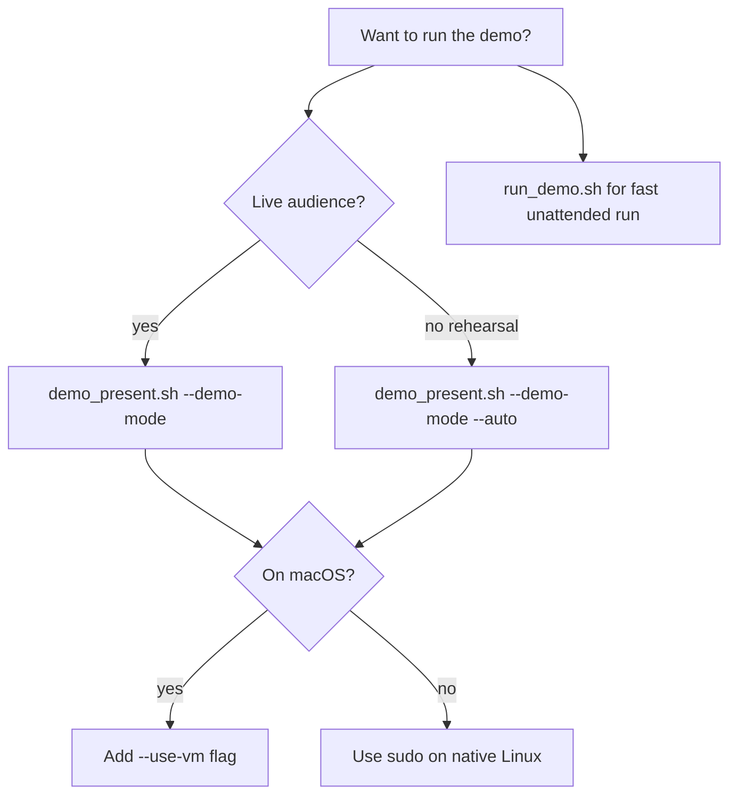

# Demo Guide — SELinux Policy-as-Code Workshop

This guide helps **newcomers**, **presenters**, and **observers** understand and run the live demo — even with no prior SELinux or GitOps experience.

**How to read this guide:**

| You are… | Read first | Then |
|----------|------------|------|
| **Completely new to SELinux** | [SELINUX_BASICS.md](SELINUX_BASICS.md) sections 1–7 (~15 min) | This guide sections 1–4, then run the demo |
| **Watching a colleague present** | Sections 1–4 below | Follow along during the 10 acts |
| **Presenting the workshop** | Whole guide + rehearse with `--auto --demo-mode` | Presenter checklist (section 13) |
| **Running the app team workflow after the demo** | [README.md](../README.md) developer section | `dev_generate_policy.sh` |

**Learning path:** [SELINUX_BASICS.md](SELINUX_BASICS.md) (concepts) → **this guide** (workshop) → [PRODUCTION_READINESS.md](PRODUCTION_READINESS.md) (admin rollout).

---

## 1. What you will see — story in plain English

This demo shows how an application team and a security admin work together to update SELinux policy safely:

1. A small Flask app runs on a Linux host with SELinux **on**.
2. The app domain (`myapp_t`) starts in **permissive** mode — the app keeps working, but denials are **logged**.
3. Integration tests hit HTTP endpoints; denials are exported to a file.
4. An **AI CLI** reads those denials and proposes updates to policy files in Git.
5. A **Pull Request body** is assembled with a plain-English summary for admins.
6. **CI** checks the policy compiles and blocks dangerous rules.
7. An admin **deploys a canary** — real policy installed, domain still permissive.
8. **Guardrails** verify file labels and monitor for new denials.
9. After a **soak period** (days in production; minutes in demo mode), the admin **enforces** — denials now block the app if policy is incomplete.
10. If something breaks, **rollback** puts the domain back to permissive instantly.

The presenter script [`scripts/demo_present.sh`](../scripts/demo_present.sh) walks through all of this with pauses between steps.

---

## 2. Demo vocabulary (for newbies)

| Term | Plain English |
|------|---------------|
| **Policy module** | The compiled SELinux rules for our app (`myapp.pp`), built from `.te` + `.fc` files |
| **Domain / `myapp_t`** | The SELinux label on the **running** Flask process |
| **AVC** | A log line when SELinux blocks (or would block) an operation — evidence for policy updates |
| **Permissive (domain)** | App keeps running; denials are logged only (`semanage permissive -a myapp_t`) |
| **Enforce** | Remove permissive — denials now **block** the app (`semanage permissive -d myapp_t`) |
| **Canary deploy** | Install real policy on a host, but keep the domain permissive while you watch for problems |
| **Soak** | Run in permissive canary for **7–14 days** (production) to catch weekly jobs, cron, logrotate |
| **PR handoff** | Assembled markdown (`policy_out/pr_body.md`) admins review — not just raw `.te` files |
| **CI** | Automated checks on every PR: compile policy + block wildcards and high-privilege allows |
| **Demo mode (`--demo-mode`)** | Workshop shortcut — skips the 7-day calendar wait only; everything else is real |

Confused about labels, `.te`/`.fc`, or `restorecon`? See [SELINUX_BASICS.md](SELINUX_BASICS.md).

---

## 3. The demo app and HTTP endpoints

The **Order Processor** is a Flask app on port **8888**. Each endpoint exercises different SELinux rules:

| Endpoint | What it does | SELinux activity |
|----------|--------------|------------------|
| `GET /` | Health check | Minimal — confirms app is up |
| `GET /save-log` | Appends a line to `/var/myapp/data.log` | `myapp_t` writes to `myapp_var_lib_t` file |
| `GET /run-script` | Runs `/opt/myapp/bin/backup.sh` | `myapp_t` executes `myapp_script_exec_t` |
| `GET /rotate-log` | Renames `data.log`, creates new file | rename/create under `myapp_var_lib_t` |

Full SELinux walkthrough of `/save-log`: [SELINUX_BASICS.md §9](SELINUX_BASICS.md).

During Act 1 the demo curls all four endpoints so AVCs are captured for the AI step.

---

## 4. Two roles in the story

| Role | Responsibility in the demo |
|------|----------------------------|
| **Application team** | Run staging tests, export AVCs, generate policy, assemble PR body |
| **Security / RHEL admin** | Review PR summary, deploy canary, verify labels, soak, enforce, rollback if needed |

Acts 1–5 = app team story. Acts 6–10 = admin story. The presenter script covers both so the audience sees the full handoff.

---

## 5. Which script should I run?

| Script | Best for | Pauses? | Full story? |
|--------|----------|---------|-------------|
| **`demo_present.sh`** | Live workshops, first-time audiences | Yes (skip with `--auto`) | Yes — 10 acts |
| **`run_demo.sh`** | Quick unattended run on native Linux | No | Partial — skips PR narration |
| **`dev_generate_policy.sh`** | Real developer workflow (not a staged demo) | No | Developer path only |



**First-time presenters:** rehearse with `--demo-mode --auto` once, then present live without `--auto`.

---

## 6. Prerequisites

### All platforms

- Clone this repository
- Python 3.9+ and `pip3 install -r cli/requirements.txt`
- **`OPENAI_API_KEY`** set (unless using `--skip-ai` with existing `policy_out/` files)
- Optional: `OPENAI_BASE_URL` / `OPENAI_API_MODEL` for LiteLLM or other OpenAI-compatible endpoints

**Don't have an API key?** Use `--skip-ai` if `policy_out/myapp.te` and `policy_out/avc.log` already exist.

### Native Linux (RHEL, Fedora, FCOS VM)

- Root or `sudo` (SELinux policy install requires it)
- SELinux **Enforcing** at OS level (app domain set permissive separately — see Basics §7)
- Packages: `audit`, `policycoreutils-python-utils`, `checkpolicy`, `selinux-policy-devel`, `ansible`, `curl`
- Port **8888** free on localhost

### macOS

SELinux does **not** run natively on macOS. Use **Podman Machine**:

```bash
bash scripts/fix_podman.sh
source ~/.local/share/selinux-demo/podman/env.sh
bash scripts/demo_present.sh --use-vm --demo-mode
```

---

## 7. How to run the demo

### First rehearsal (recommended)

```bash
# Native Linux
export OPENAI_API_KEY="your-key"
sudo bash scripts/demo_present.sh --demo-mode --auto

# macOS
export OPENAI_API_KEY="your-key"
bash scripts/demo_present.sh --use-vm --demo-mode --auto
```

**Expected start of output:**

```text
SELinux Policy-as-Code — Presenter Demo
Demo mode ON — soak timer bypassed for acts 8–9 only
Acts: 1-10 | use-vm=0 | skip-ai=0 | auto=1

════════════════════════════════════════════════════════════
  ACT 1: Staging
  App team runs integration tests with myapp_t in permissive mode
════════════════════════════════════════════════════════════
```

Typical duration: **15–25 minutes** with pauses; **8–12 minutes** with `--auto`.

### Live presentation

```bash
export OPENAI_API_KEY="your-key"
sudo bash scripts/demo_present.sh --demo-mode
```

Press **Enter** at each pause to explain the next act before commands run.

### Partial demo (time-limited)

```bash
# Developer + CI only (~8 min)
sudo bash scripts/demo_present.sh --demo-mode --auto --acts 1-5

# Admin + guardrails only (needs policy_out/ from acts 1–5 first)
sudo bash scripts/demo_present.sh --demo-mode --auto --acts 6-10
```

### No API key (offline rehearsal)

```bash
sudo bash scripts/demo_present.sh --skip-ai --demo-mode --auto
```

Requires existing `policy_out/myapp.te`, `policy_out/myapp.fc`, and preferably `policy_out/avc.log`.

---

## 8. Demo mode vs production

| Topic | Production | Workshop (`--demo-mode`) |
|-------|------------|---------------------------|
| Permissive soak | **7–14 real days** | Act 8 pre-seeds an 8-day-old marker |
| Enforce gate | `check_soak_ready.sh` must pass | Act 9 uses `force_enforce=true` (break-glass) |
| Everything else | Same commands | **Real** — not simulated |

**Say this to the audience before Act 8:**

> "In production we wait a full business cycle so weekly cron and logrotate fire. Demo mode only skips the calendar — CI, labeling checks, and canary deploy are all real."

Never use `force_enforce=true` in real production without documented approval. See [PRODUCTION_READINESS.md](PRODUCTION_READINESS.md).

---

## 9. The 10 acts — timeline and walkthrough

```text
Act 1–2   App team    staging + export AVCs
Act 3–5   App team    AI generate + PR body + CI
Act 6–7   Admin       canary deploy + guardrails
Act 8–9   Admin       soak gate + enforce
Act 10    Admin       rollback (show commands only)
```

Each act prints a blue banner. Below: plain English, what runs, what you should see, and what to say.

---

### Act 1 — Staging (Application team)

**In plain English:** Install the app, turn on permissive mode for `myapp_t`, and run integration tests.

**What runs:** `setup_staging_env.sh` + curl to all four endpoints.

**What you should see:**

```bash
$ curl -sf http://127.0.0.1:8888/save-log
{"status":"ok","message":"Log entry saved",...}

$ sudo semanage permissive -l
myapp_t
```

**SELinux concept:** Per-domain permissive — [SELINUX_BASICS.md §7](SELINUX_BASICS.md).

**Talking point:** *"We intentionally run permissive first so the app keeps working while we collect an accurate list of what SELinux would block."*

---

### Act 2 — AVC export (Application team)

**In plain English:** Copy denial lines from the audit log into a file for the AI.

**What runs:** Export to `policy_out/avc.log`.

**What you should see:**

```bash
$ wc -l policy_out/avc.log
42 policy_out/avc.log

$ head -1 policy_out/avc.log
type=AVC msg=audit(...): avc: denied { write } for comm="python3"
  scontext=system_u:system_r:myapp_t:s0
  tcontext=system_u:object_r:myapp_var_lib_t:s0 tclass=file permissive=1
```

**SELinux concept:** Reading AVC lines — [SELINUX_BASICS.md §8](SELINUX_BASICS.md).

**Talking point:** *"Every line here is evidence from our tests — not a generic template policy."*

**Show on screen:** `wc -l policy_out/avc.log` and one sample AVC line.

---

### Act 3 — AI policy generation (Application team)

**In plain English:** The CLI merges AVC evidence into existing policy files and writes a human-readable summary.

**What runs:** `cli/selinux_gen.py` with `--generate-only`.

**What you should see:**

```text
[INFO] Wrote policy_out/myapp.te
[INFO] Wrote policy_out/pr_summary.md
[INFO] Policy version bumped to 1.0.3
```

**SELinux concept:** `.te` allow rules — [SELINUX_BASICS.md §5](SELINUX_BASICS.md).

**Talking point:** *"Policy is merged into the existing module — not replaced blindly. CI will reject wildcards and allows to shadow_t, unconfined_t, sysadm_t."*

**Show on screen:** `head -30 policy_out/pr_summary.md` (look for `### Network Bindings` headings).

---

### Act 4 — PR handoff (Application team → Admin)

**In plain English:** Build the GitHub PR body admins actually review.

**What runs:** `assemble_pr_body.sh` → `policy_out/pr_body.md`.

**What you should see:**

```bash
$ grep -E 'Security and Sysadmin|forbidden-patterns|Network Bindings' policy_out/pr_body.md | head -5
### Network Bindings
| **No Over-Permissive Grants** | ⬜ Pass / ⬜ Reject | CI `forbidden-patterns`
```

**Talking point:** *"Developers don't paste free-form text — the pipeline assembles what admins need to sign off, including AVC excerpts."*

**Show on screen:** Admin Pass/Reject table in `policy_out/pr_body.md`.

---

### Act 5 — CI gates (Automatic on PR)

**In plain English:** Run the same checks GitHub Actions runs before merge.

**What runs:** `validate_forbidden_patterns.sh` + `compile_and_validate.sh`.

**What you should see:**

```text
[INFO] Forbidden-pattern checks passed for myapp
[INFO] Compiling myapp in policy_out
[INFO] policy_module() present
```

**Talking point:** *"Admins shouldn't review syntax errors — CI catches those before merge."*

---

### Act 6 — Canary deploy (Admin)

**In plain English:** Install the real policy module but keep `myapp_t` permissive for soak.

**What runs:** `ansible/deploy_canary.yml` (or `apply_policy.sh` fallback).

**What you should see:**

```bash
$ sudo semanage permissive -l
myapp_t

$ curl -sf http://127.0.0.1:8888/
{"status":"ok","service":"order-processor",...}
```

**SELinux concept:** `semodule -i` + `restorecon` — [SELINUX_BASICS.md §5–6](SELINUX_BASICS.md).

**Talking point:** *"We deploy the real module early, but we don't enforce until we've watched production-like workloads."*

Soak marker written: `/var/myapp/selinux_canary_deployed_at`.

---

### Act 7 — Production guardrails (Admin)

**In plain English:** Verify file labels are correct and check for lingering denials before enforce.

**What runs:** `verify_file_contexts.sh` + `monitor_avc.sh`.

**What you should see:**

```text
[INFO] File context verification passed for myapp
[INFO] AVC report: domain=myapp_t since=... count=0
```

**SELinux concept:** `restorecon -n` dry-run — [SELINUX_BASICS.md §6](SELINUX_BASICS.md).

**Talking point:** *"The most common production surprise is wrong file labels on existing data — we verify before restart."*

---

### Act 8 — Soak period (Admin)

**In plain English:** Explain why production waits 7–14 days; demo mode pre-seeds an old marker to show the gate passing.

**What runs:** `check_soak_ready.sh` (passes in `--demo-mode` after marker is pre-seeded).

**What you should see (demo mode):**

```text
[WARN] DEMO MODE: simulating completed soak (pre-seeding marker to 8 days ago)
[INFO] Soak gate passed — safe to enforce myapp_t
```

**Without demo mode** (expected failure right after canary):

```text
[ERROR] Soak period not met — wait 6 more day(s)
```

**SELinux concept:** `semanage permissive -a` vs soak timer — [SELINUX_BASICS.md §7](SELINUX_BASICS.md), [PRODUCTION_READINESS.md §7](PRODUCTION_READINESS.md).

**Talking point:** *"In production we wait a full business cycle. Demo mode only skips the calendar."*

---

### Act 9 — Enforce (Admin)

**In plain English:** Remove permissive mode — denials now block the app if policy is incomplete.

**What runs:** `ansible/enforce_production.yml` (with `force_enforce=true` in demo mode).

**What you should see:**

```bash
$ sudo semanage permissive -l
# (empty — myapp_t not listed)

$ curl -sf http://127.0.0.1:8888/save-log
{"status":"ok",...}
```

**SELinux concept:** `semanage permissive -d` — [SELINUX_BASICS.md §7](SELINUX_BASICS.md).

**Talking point:** *"After enforce, any missing permission becomes a hard denial — that's why soak and monitoring matter."*

---

### Act 10 — Emergency rollback (Admin)

**In plain English:** Show the outage playbook — not executed in the workshop.

**What runs:** Prints commands only.

**Steps shown:**

1. `semanage permissive -a myapp_t` — instant relief, no reboot
2. `ausearch -m avc -ts recent > /tmp/prod_outage_denials.log`
3. `ansible-playbook ansible/emergency_rollback.yml`

**Talking point:** *"If enforce causes an outage, the first move is permissive domain — not disabling SELinux globally."*

Details: [PRODUCTION_READINESS.md §12](PRODUCTION_READINESS.md).

---

## 10. What success looks like after the full demo

| Check | Expected result |
|-------|-----------------|
| `policy_out/pr_body.md` | Exists with admin table + AVC excerpt |
| `policy_out/myapp.pp` | Compiled policy package |
| `sudo semanage permissive -l` | Empty (after Act 9) |
| `curl http://127.0.0.1:8888/` | `{"status":"ok",...}` |
| `getenforce` | `Enforcing` (OS was never set permissive) |

---

## 11. Architecture diagram (for slides)

```text
┌──────────────┐    AVC logs     ┌──────────────┐    PR + CI    ┌──────────────┐
│  Flask app   │ ──────────────► │ selinux_gen  │ ────────────► │ GitHub PR    │
│  (myapp_t)   │                 │ + assemble   │               │ + admin review│
└──────────────┘                 └──────────────┘               └──────┬───────┘
       ▲                                                                │
       │                     canary → soak → enforce                     │
       └────────────────────────────────────────────────────────────────┘
```

---

## 12. Key files to know

| Path | Purpose |
|------|---------|
| `app/app.py` | Demo application |
| `selinux/myapp.te` | Type enforcement rules — Git source of truth |
| `selinux/myapp.fc` | File path → label mappings |
| `selinux/policy_version.txt` | SemVer bumped on each generation |
| `policy_out/avc.log` | Exported denials (AI input) |
| `policy_out/pr_summary.md` | Plain-English summary for admins |
| `policy_out/pr_body.md` | Assembled GitHub PR body |
| `ansible/deploy_canary.yml` | Permissive canary deploy |
| `ansible/enforce_production.yml` | Remove permissive + enforce |
| `ansible/emergency_rollback.yml` | Outage response |
| `.github/PULL_REQUEST_TEMPLATE/selinux_policy_review.md` | Admin review template |

---

## 13. Troubleshooting

| Problem | What it looks like | Fix |
|---------|-------------------|-----|
| `OPENAI_API_KEY not set` | Script exits immediately | `export OPENAI_API_KEY=...` or `--skip-ai` |
| `Run as root` | Error before Act 1 | `sudo bash scripts/demo_present.sh ...` |
| `Podman VM unreachable` | Connection refused to VM | `bash scripts/fix_podman.sh`; `podman machine start` |
| No AVC lines exported | `wc -l` shows 0 | Re-run Act 1; check `systemctl status auditd` |
| AI generation fails | HTTP/timeout errors | Check `OPENAI_BASE_URL`; use `--skip-ai` |
| Compile fails on macOS | Podman/checkmodule error | Use `--use-vm`; compile runs inside VM |
| Enforce fails (no demo mode) | `Soak period not met` | Use `--demo-mode` for workshops |
| Port 8888 in use | curl connection refused | Stop conflicting service |
| `ansible-playbook not found` | Warning + fallback | Install ansible, or demo uses `apply_policy.sh` |

---

## 14. Presenter checklist

**Before the session:**

- [ ] Read [SELINUX_BASICS.md](SELINUX_BASICS.md) sections 3–7 if new to SELinux
- [ ] Rehearse with `--demo-mode --auto` once on your platform
- [ ] Confirm `OPENAI_API_KEY` works (or prepare `--skip-ai`)
- [ ] Terminal font size readable for audience
- [ ] Know which acts to skip if short on time (`--acts 1-7` is a good default)

**During the session:**

- [ ] Introduce the two roles (app team vs admin)
- [ ] Call out **`--demo-mode`** honestly before Act 8
- [ ] Show `pr_summary.md` and PR template table at Act 4
- [ ] Emphasize port **8888** uses **`unreserved_port_t`** (not `http_port_t`)

**After the session:**

- [ ] Point admins to [PRODUCTION_READINESS.md](PRODUCTION_READINESS.md)
- [ ] Point developers to `dev_generate_policy.sh` and [README.md](../README.md)

---

## 15. Quick command reference

```bash
# Full paced workshop
sudo bash scripts/demo_present.sh --demo-mode

# Rehearsal (no pauses)
sudo bash scripts/demo_present.sh --demo-mode --auto

# macOS
bash scripts/demo_present.sh --use-vm --demo-mode

# Fast unattended (no narration)
sudo bash scripts/run_demo.sh

# Help
bash scripts/demo_present.sh --help
```

---

## Document map

| Guide | Sections to read | Audience |
|-------|------------------|----------|
| [SELINUX_BASICS.md](SELINUX_BASICS.md) | §1–7 concepts; §9 worked example | New to SELinux |
| **This file** | §1–4 before demo; §9 during demo | Presenters and observers |
| [PRODUCTION_READINESS.md](PRODUCTION_READINESS.md) | §1–14 after demo | RHEL admins |
| [README.md](../README.md) | Self-service table | Day-to-day commands |
