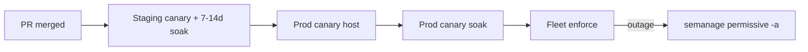

# Production Readiness Runbook (RHEL Admin)

This guide is for **RHEL/Fedora admins** who reviewed the workshop demo and are ready to roll out SELinux policy changes safely in production.

**How to read this guide:**

| You are… | Read first | Then |
|----------|------------|------|
| **New to SELinux** | [SELINUX_BASICS.md](SELINUX_BASICS.md) sections 1–7.5 | This guide sections 1–4 |
| **Saw the demo** | [DEMO_GUIDE.md](DEMO_GUIDE.md) acts 6–10 | This guide from section 4 onward |
| **Running day-to-day deploys** | Section 5 (deploy paths) | Phases 1–6 as your checklist |
| **Reviewing policy PRs** | [SELINUX_BEST_PRACTICES.md](SELINUX_BEST_PRACTICES.md) §8 | PR template + CI mapping §15 |

**Learning path:** [SELINUX_BASICS.md](SELINUX_BASICS.md) (concepts) → [DEMO_GUIDE.md](DEMO_GUIDE.md) (workshop) → [SELINUX_BEST_PRACTICES.md](SELINUX_BEST_PRACTICES.md) (principles) → **this guide** (admin rollout).

---

## 1. Why production is different from the workshop

High-blast-radius SELinux changes need **per-domain permissive soak**, **path labeling verification**, and **phased rollout** before you remove the permissive flag.

| Topic | Workshop (`--demo-mode`) | Production |
|-------|--------------------------|------------|
| Soak wait | Skipped (pre-seeded 8-day marker) | **7–14 real calendar days** |
| Enforce | `force_enforce=true` (break-glass) | `check_soak_ready.sh` **must pass** |
| Goal | Teach the pipeline | **No surprise outages** |
| Rollback | Commands shown only | Run `emergency_rollback.yml` if needed |

**Never** use `force_enforce=true` in production without documented break-glass approval and on-call awareness.

---

## 2. Plain-English glossary

| Term | Plain English |
|------|---------------|
| **Canary host** | One production node that gets new policy first — still permissive while you watch |
| **Soak** | Run permissive canary for 7–14 days so weekly cron, logrotate, and restarts surface missing rules |
| **Fleet** | All production hosts after canary proves stable |
| **Enforce gate** | Automated check (`check_soak_ready.sh`) — soak time elapsed + AVC count within limit |
| **Break-glass** | `force_enforce=true` — bypass soak gate; use only in emergencies with approval |
| **Path labeling** | Files on disk must match `.fc` rules (`restorecon` + verify before restart) |
| **Per-domain permissive** | Only `myapp_t` is permissive; the OS stays **Enforcing** globally |

SELinux theory (labels, `.te`/`.fc`, `semanage`): [SELINUX_BASICS.md](SELINUX_BASICS.md).

---

## 3. The rollout journey

Production is **never** auto-enforced on merge. You move through staging → prod canary → fleet enforce deliberately.



**Recommended sequence:**

```text
PR merge → staging canary (auto on main)
         → staging soak 7–14 days (monitor_avc daily)
         → prod canary host (--limit canary)
         → prod canary soak + monitor_avc
         → enforce fleet (soak gate must pass)
```

---

## 3.5 Soak in plain English

**Soak** is not idle waiting — it is **active monitoring** while the app runs with **real policy** but **`myapp_t` still permissive**.

```text
Day 0     deploy_canary.yml
          → semodule -i myapp.pp + semanage permissive -a myapp_t
          → marker: /var/lib/myapp/selinux_canary_deployed_at

Week 1–2  Daily monitor_avc.sh (--max-avc 0)
          → getenforce stays Enforcing; only myapp_t is log-only
          → catch weekly cron, logrotate, cert renewals, restarts

Gate      check_soak_ready.sh passes ALL:
          → marker age ≥ 7 days
          → zero new myapp_t AVCs since marker
          → deploy report at /var/lib/myapp/selinux_deploy_report.json with pass status + endpoint coverage

Enforce   semanage permissive -d myapp_t
          → denials now block the app if policy is incomplete
```

| Week | Admin action | Pass looks like |
|------|--------------|-----------------|
| **Week 0** | Deploy canary to staging or prod-canary host | App healthy; `myapp_t` in `semanage permissive -l`; marker file exists |
| **Week 1** | Daily `monitor_avc.sh` | `count=0`, exit 0 each day |
| **Week 2** | Run `check_soak_ready.sh` manually | `Soak gate passed — safe to enforce myapp_t` |
| **Enforce day** | `enforce_production.yml` | `semanage permissive -l` empty; app still responds |

**Two-layer reminder:** `getenforce` = **Enforcing** throughout soak. Only **`myapp_t`** is on the permissive list until enforce.

**If policy changes during soak:** redeploy canary, extend `.te`, and **reset the soak clock** (new marker timestamp). See [§14 Troubleshooting](#14-troubleshooting).

Full timeline for beginners: [SELINUX_BASICS.md §7.5](SELINUX_BASICS.md).

---

## 4. Three deploy paths

| When | Who | How |
|------|-----|-----|
| **PR open** | CI (automatic) | `smoke-tests`, `forbidden-patterns`, `compile-policy` |
| **Merge to `main`** | Pipeline (automatic) | [`.github/workflows/selinux-staging-canary.yml`](../.github/workflows/selinux-staging-canary.yml) → `staging-canary` deploy + `staging-endpoint-smoke` job |
| **Production cutover** | Admin (manual) | **SELinux Policy Deploy** workflow → `enforce` + GitHub `production` Environment approval |

Manual Ansible (AWX/Tower compatible) uses the same playbooks — see phases below and [README.md § Admins](../README.md).

**Merge pipeline:** after `staging-canary` installs policy on the self-hosted staging runner, the **`staging-endpoint-smoke`** job runs `wait_for_endpoints.sh` and verifies `/var/lib/myapp/selinux_deploy_report.json` exists. This catches regressions before an admin starts prod canary.

**Staging soak is manual:** merge to `main` triggers staging canary automatically, but there is **no timer** before production — admins must run daily `monitor_avc.sh` and wait 7–14 days before prod canary/enforce.

---

## 5. Pre-production testing matrix

| Phase | Goal | Command / playbook | **Pass looks like** |
| --- | --- | --- | --- |
| **Syntax and compilation** | `.te` / `.fc` compile without errors | `bash scripts/compile_and_validate.sh selinux` (refpolicy Makefile) | `myapp.pp` built, no errors |
| **Semantic assertions** | Required allows present in compiled module | `bash scripts/validate_policy_semantics.sh selinux` (CI `policy-semantics` job) | `sesearch` checks pass |
| **Forbidden patterns** | No wildcards or high-privilege allows | `bash scripts/validate_forbidden_patterns.sh selinux` | `Forbidden-pattern checks passed` |
| **Path labeling** | On-disk contexts match `.fc` before restart | `bash scripts/verify_file_contexts.sh --log-dir /var/log/myapp` | `File context verification passed` |
| **Staging canary** | Permissive domain + integration smoke | Merge to `main` or `ansible-playbook ansible/deploy_canary.yml -i ansible/inventory.staging.yml` | All **six** endpoints return HTTP 200; services run as `myapp_t` / `myapp_backend_t`; deploy report `"status": "pass"` with `domain_context_verified: true` |
| **Canary AVC gate** | Block canary if denials already present | `deploy_canary.yml` (default `canary_max_avc=0`) | Playbook fails if recent `myapp_t` AVC count exceeds threshold |
| **Post-merge staging smoke** | CI re-check after canary on runner | `staging-endpoint-smoke` job in `selinux-staging-canary.yml` | `wait_for_endpoints.sh` passes; deploy report present |
| **Permissive soak** | Capture weekly cron, logrotate, restarts (7–14 days) | `semanage permissive -a myapp_t` + daily `monitor_avc.sh` | `count=0`, exit 0 |
| **Production canary host** | Deploy to one node before fleet | `deploy_canary.yml --limit canary` | Marker file written, app + backend healthy |
| **Enforce gate** | Soak elapsed, zero domain AVCs, deploy report pass | `check_soak_ready.sh` (optional `--auto-tier`) in `enforce_production.yml` | `Soak gate passed — safe to enforce myapp_t` |
| **Production enforce** | Remove permissive domain | `ansible/enforce_production.yml` | `semanage permissive -l` empty; **six** production smoke tests pass under enforcing |
| **Outage response** | Instant relief + AVC capture | `ansible/emergency_rollback.yml` | Domain back in permissive list; endpoints pass; deploy report written; soak marker reset |

---

## 6. Phase 1 — Per-domain permissive soak (canary)

This phase is **canary soak after merge** — not the developer's **staging discovery** permissive (Acts 1–2 in the demo, where the app team collects AVCs to write initial policy). Here the **full** `myapp.pp` is already installed; permissive mode lets you watch real workloads before enforce.

Enable permissive mode **only** for the application domain (OS stays enforcing):

```bash
sudo semanage permissive -a myapp_t
```

**Verify it is active:**

```bash
$ sudo semanage permissive -l
myapp_t
```

**Duration:** 7 to 14 days by default (or shorter when `soak_auto_tier=true` / `check_soak_ready.sh --auto-tier` classifies a low blast-radius change via `sediff`).

The canary playbook records a deploy timestamp at `/var/lib/myapp/selinux_canary_deployed_at` (epoch seconds), runs **`semodule -DB`** so dontaudit rules do not hide soak AVCs, and installs policy with **`semodule -i`** (in-place upgrade — no `semodule -r`). Production enforce refuses to run until soak requirements pass (unless `force_enforce=true` break-glass).

**Admin sign-off — host-level `semodule -DB`:** disabling dontaudit affects the **entire host**, not just `myapp_t`. If canary fails or rollback runs, playbooks call **`semodule -B`** to restore the baseline. If enforce never runs after a successful canary, `-DB` stays active until enforce — document this in the change ticket. Failed canary and rollback paths always restore `-B`.

**Admin sign-off — domain context verification:** deploy reports and soak gates require `wait_for_endpoints.sh` to confirm `myapp.service` runs as **`myapp_t`** and `myapp-backend.service` as **`myapp_backend_t`**. Without this check, a mislabeled entrypoint (`init_t`) can pass all HTTP gates with zero AVCs while the custom policy was never applied.

**Canary AVC gate:** `deploy_canary.yml` counts recent `myapp_t` AVC lines and **fails** if the count exceeds `canary_max_avc` (default **`0`**). Override only with explicit approval:

```bash
ansible-playbook ... ansible/deploy_canary.yml -e "canary_max_avc=2"
```

Do not raise the threshold to bypass missing policy — fix `.te`, redeploy, and re-soak instead.

**List vs add:** `semanage permissive -l` lists domains; `-a` adds, `-d` removes. See [SELINUX_BASICS.md §7](SELINUX_BASICS.md).

---

## 7. Phase 2 — Path labeling verification

After `semodule -i`, existing files may retain old contexts. Verify **before** restarting the service:

```bash
sudo bash scripts/verify_file_contexts.sh \
  --install-root /opt/myapp \
  --var-dir /var/lib/myapp \
  --log-dir /var/log/myapp \
  --app-name myapp
```

**Pass looks like:**

```text
[INFO] File context verification passed for myapp
```

**Fail looks like** (would relabel on restorecon):

```text
[ERROR] restorecon dry-run would change: /var/log/myapp/data.log
```

This runs `matchpathcon` on key paths and fails if `restorecon -Rv -n` would relabel anything under the data directory.

Always run verification immediately after policy install and before `systemctl restart`.

Full `restorecon` walkthrough: [SELINUX_BASICS.md §6](SELINUX_BASICS.md).

---

## 8. Phase 3 — Systemd and cron attestation

Staging tests must use **systemd**, not manual `python app.py`:

```bash
sudo systemctl restart myapp.service
sudo systemctl is-active myapp.service
curl -sf http://127.0.0.1:8888/rotate-log
```

**Cron (optional — does not run as `myapp_t`):**

The example below runs `backup.sh` as **root** in the **`cron_t`** domain — it does **not** exercise `myapp_t` during soak. Use it only to illustrate why real production soak must include schedulers that run **as the app domain** (systemd timers, app-owned cron, etc.).

```bash
# Illustration only — runs as cron_t/root, NOT myapp_t
echo '0 2 * * * root /opt/myapp/bin/backup.sh' | sudo tee /etc/cron.d/myapp-backup-smoke
```

For this PoC, use **`GET /rotate-log`** (Flask in `myapp_t`) to simulate log rotation during staging tests.

The PoC validates log rotation via HTTP `/rotate-log`. Real `logrotate` cron requires capturing AVCs from `logrotate_t` and extending policy — not included in the PoC module.

**Monitoring agents (Datadog, Promtail, Prometheus):** org-specific domains — verify manually during soak if agents read `/var/lib/myapp`.

---

## 9. Phase 4 — Daily AVC monitoring

During soak, run daily. Scripts live in the **repo**, not under `/opt/myapp` in this PoC.

**Cron example** (adjust `REPO_ROOT` to where you cloned this repository on the host):

```bash
# /etc/cron.d/myapp-selinux-monitor
REPO_ROOT=/opt/selinux-demo
0 8 * * * root bash ${REPO_ROOT}/scripts/monitor_avc.sh --domain myapp_t --marker-file /var/lib/myapp/selinux_canary_deployed_at --max-avc 0 >> /var/log/myapp_avc_monitor.log 2>&1
```

**Manual run from repo:**

```bash
bash scripts/monitor_avc.sh \
  --domain myapp_t \
  --marker-file /var/lib/myapp/selinux_canary_deployed_at \
  --paths /opt/myapp,/var/lib/myapp \
  --max-avc 0
```

**Pass looks like:**

```text
[INFO] AVC report: domain=myapp_t since=03/05/2026 14:22:01 count=0
[INFO] AVC monitoring check complete
```

**Fail looks like** (new denials during soak):

```text
[INFO] AVC report: domain=myapp_t since=... count=3
[ERROR] AVC count 3 exceeds threshold 0
--- recent matching AVC lines ---
type=AVC ... scontext=...:myapp_t:s0 ...
```

Investigate new AVCs before enforce — extend policy and redeploy canary if needed.

**Optional automation flags:**

```bash
# JSON output for metrics / log aggregation
bash scripts/monitor_avc.sh --domain myapp_t --format json --max-avc 0

# Page on-call when threshold exceeded (Slack/PagerDuty-compatible webhook)
bash scripts/monitor_avc.sh --domain myapp_t --max-avc 0 \
  --notify-webhook "https://hooks.example.com/selinux-avc"
```

---

## 10. Phase 5 — Production canary host groups

Copy [`ansible/inventory.production.example.yml`](../ansible/inventory.production.example.yml) to `ansible/inventory.production.yml`.

**Inventory layout:**

```text
inventory.production.yml
├── canary group     → prod-canary-1 only (first)
└── production group → all prod hosts (canary + fleet)
```

The `canary` group is **one node** for the first production deploy. The `production` group includes canary plus the rest of the fleet for later rollout.

**Step-by-step:**

```bash
# 1. Canary node only (permissive + policy install)
ansible-playbook -i ansible/inventory.production.yml ansible/deploy_canary.yml \
  --limit canary \
  -e "policy_pp_path=$(pwd)/selinux/myapp.pp"

# 2. Daily monitoring on canary during soak
bash scripts/monitor_avc.sh \
  --domain myapp_t \
  --marker-file /var/lib/myapp/selinux_canary_deployed_at \
  --max-avc 0

# 3. Optional: permissive rollout to full fleet before enforce
ansible-playbook -i ansible/inventory.production.yml ansible/deploy_canary.yml \
  --limit production \
  -e "policy_pp_path=$(pwd)/selinux/myapp.pp"

# 4. Enforce (soak gate runs automatically)
ansible-playbook -i ansible/inventory.production.yml ansible/enforce_production.yml \
  -e "policy_pp_path=$(pwd)/selinux/myapp.pp"

# Break-glass only:
ansible-playbook ... enforce_production.yml -e "force_enforce=true"
```

**`--limit canary`** targets only hosts in the `canary` group — not the full fleet. Use `--limit production` when rolling policy to all nodes while still permissive.

---

## 11. Phase 6 — Emergency rollback

If enforce causes an outage, run **`ansible-playbook ... ansible/emergency_rollback.yml`** (or GitHub Actions → **SELinux Policy Deploy** → `rollback`). The playbook performs:

1. **`semanage permissive -a myapp_t`** — instant relief, no reboot
2. **Remove stale `/run/myapp/notify.sock`**
3. **Restart** `myapp-backend.service` and `myapp.service`
4. **`wait_for_endpoints.sh`** — all six HTTP endpoints must return HTTP 200
5. **Reset soak marker** — writes a new timestamp to `/var/lib/myapp/selinux_canary_deployed_at` (full re-soak required before next enforce)
6. **`post_deploy_report.sh --phase rollback`** → `/var/lib/myapp/selinux_deploy_report.json`
7. **Export AVCs** to `/tmp/emergency_avc.log` and optionally run AI patch generation (when `OPENAI_API_KEY` is set)

**Expected relief:**

```bash
$ sudo semanage permissive -l
myapp_t

$ bash scripts/wait_for_endpoints.sh --host 127.0.0.1 --retries 3 --delay 2
[INFO] All endpoints ready

$ cat /var/lib/myapp/selinux_deploy_report.json
{"status":"pass","phase":"rollback",...}
```

**After rollback:** export AVCs, extend policy, open a PR, redeploy canary, and **wait the full soak period again** — the marker was reset.

See [`ansible/emergency_rollback.yml`](../ansible/emergency_rollback.yml).

Workshop demo shows these commands in [DEMO_GUIDE.md § Act 10](DEMO_GUIDE.md).

---

## 12. Enforce pre-checks (automated)

`enforce_production.yml` runs before removing permissive:

1. **`check_soak_ready.sh`** — minimum soak days (optional **`--auto-tier`** via `sediff` blast radius) + AVC count threshold + passing deploy report with verified domain context at `/var/lib/myapp/selinux_deploy_report.json`
2. **`verify_file_contexts.sh`** — labeling dry-run (`restorecon` + `.fc` is source of truth; includes `/var/log/myapp`)
3. **Remove stale `/run/myapp/notify.sock`** — avoids false-positive socket checks after restarts
4. **`systemctl restart`** — `myapp-backend.service` then `myapp.service`
5. **Unified readiness** — `bash scripts/wait_for_endpoints.sh` (systemd + domain context + all six HTTP endpoints)
6. **Deploy report** — `bash scripts/post_deploy_report.sh` writes `/var/lib/myapp/selinux_deploy_report.json` including `domain_context`

Enforce runs inside an Ansible **block/rescue**: if smoke tests or the deploy report fail, the playbook restores **`myapp_t` to permissive**, restarts services, re-checks endpoints, then fails with guidance to inspect AVCs and the deploy report.

```bash
bash scripts/wait_for_endpoints.sh --host 127.0.0.1 --retries 15 --delay 2
bash scripts/post_deploy_report.sh --phase enforce --domain myapp_t --var-dir /var/lib/myapp \
  --marker-file /var/lib/myapp/selinux_canary_deployed_at --project-root /path/to/selinux-demo
```

`deploy_canary.yml` runs the same Tier 6 endpoints (minus `/`) during canary exercise, with the same backend and notify-socket waits.

### `check_soak_ready.sh` — pass vs fail examples

**FAIL — canary deployed today:**

```bash
$ bash scripts/check_soak_ready.sh \
    --domain myapp_t \
    --marker-file /var/lib/myapp/selinux_canary_deployed_at

[INFO] Soak: 1 day(s) elapsed (minimum 7)
[INFO] AVCs since canary deploy for myapp_t: 0 (maximum 0)
[ERROR] Soak period not met — wait 6 more day(s) or use force_enforce=true (break-glass only)
```

**FAIL — AVCs still appearing:**

```bash
[INFO] Soak: 10 day(s) elapsed (minimum 7)
[INFO] AVCs since canary deploy for myapp_t: 2 (maximum 0)
[ERROR] Too many AVC denials since canary deploy (2 > 0)
```

**PASS — after 8 days, zero AVCs:**

```bash
$ bash scripts/check_soak_ready.sh \
    --domain myapp_t \
    --marker-file /var/lib/myapp/selinux_canary_deployed_at

[INFO] Soak: 8 day(s) elapsed (minimum 7)
[INFO] AVCs since canary deploy for myapp_t: 0 (maximum 0)
[INFO] Soak gate passed — safe to enforce myapp_t
```

Manual pre-check before enforce:

```bash
bash scripts/check_soak_ready.sh \
  --domain myapp_t \
  --marker-file /var/lib/myapp/selinux_canary_deployed_at
```

---

## 12.5 App team incident card

When SELinux deploy or enforce affects the app, app teams need fast, non-ambiguous signals — not generic HTTP 500s that look like application regressions.

### What you will see

| Signal | Likely meaning |
|--------|----------------|
| `systemctl status myapp` / `myapp-backend` → `failed` | Service did not start after policy restart |
| `GET /` returns `"selinux": { "domain_permissive": false, "mode": "Enforcing" }` | Enforce is active — denials now block |
| Endpoint JSON includes `"selinux_context"` and `"Permission denied"` | SELinux denial (check AVCs, not app logic first) |
| `/var/lib/myapp/selinux_deploy_report.json` with `"status": "fail"` | Last canary/enforce/rollback deploy did not pass smoke |

### 60-second checklist (app team)

```bash
systemctl is-active myapp myapp-backend
curl -sf http://127.0.0.1:8888/ | python3 -m json.tool
bash scripts/wait_for_endpoints.sh --host 127.0.0.1 --retries 3 --delay 2
cat /var/lib/myapp/selinux_deploy_report.json
```

### Do / do not

| Do | Do not |
|----|--------|
| Page the SELinux/admin on-call with deploy phase + report JSON | Run `setenforce 0` globally |
| Capture `ausearch -m avc -ts recent` excerpt | Add broad `bin_t` execute rules locally |
| Retry after admin sets domain permissive or patches policy | Re-deploy app code alone without policy fix |

### Expected recovery loop

```text
Outage → semanage permissive -a myapp_t (admin) → export AVCs → policy PR → canary redeploy → soak → enforce
```

Deploy feedback artifact: **`/var/lib/myapp/selinux_deploy_report.json`** (written by canary, enforce, and rollback playbooks).

---

## 13. Admin sign-off checklist

Before you enforce on production, confirm:

- [ ] Staging soak **7+ days** complete
- [ ] `monitor_avc.sh --max-avc 0` clean for a full business cycle (including weekends)
- [ ] Prod canary host deployed and soaked separately
- [ ] `verify_file_contexts.sh` passed after last canary deploy
- [ ] `myapp-backend.service` active; `:8889/health` and `/notify-socket` succeed on canary host
- [ ] PR admin review table signed off ([PR template](../.github/PULL_REQUEST_TEMPLATE/selinux_policy_review.md))
- [ ] Change ticket documents enforce window and rollback owner
- [ ] Rollback playbook tested on staging **or** on-call briefed on `emergency_rollback.yml`
- [ ] `semanage permissive -l` shows `myapp_t` on target hosts (still permissive pre-enforce)

---

## 14. Troubleshooting

| Problem | What it looks like | What to do |
|---------|-------------------|------------|
| **Enforce fails soak gate** | `Soak period not met` or `Too many AVC denials` | Wait remaining days; fix policy from AVCs; redeploy canary — do **not** use `force_enforce` without approval |
| **Mislabeled files after deploy** | `verify_file_contexts.sh` fails | Run `restorecon -Rv /opt/myapp /var/lib/myapp /var/log/myapp /run/myapp`; re-verify; see [Basics §6](SELINUX_BASICS.md) |
| **AVCs spike during soak** | `monitor_avc.sh` exits non-zero | Export AVCs, extend `.te`, PR + CI, redeploy canary, **reset soak clock** |
| **Ansible inventory missing** | `Could not match supplied host pattern` | Copy `inventory.production.example.yml` → `inventory.production.yml`; set real hostnames |
| **Canary marker missing** | `Canary marker not found` | Run `deploy_canary.yml` first — marker is written on canary deploy |
| **Audit tools unavailable** | `Could not determine AVC count` | Install `audit` package; ensure `auditd` is running |
| **App fails after enforce** | curl errors; AVCs in enforcing mode | `semanage permissive -a myapp_t` immediately; run emergency rollback playbook |
| **`/notify-socket` fails post-enforce** | HTTP 500; stale socket on disk | Remove `/run/myapp/notify.sock` and restart backend; playbooks do this automatically |
| **`/probe-backend` fails post-enforce** | `Permission denied` on TCP connect | Check backend on `:8889`; look for `tcp_socket getopt` or `cert_t` AVCs on `myapp_t` |
| **`/run-script` fails post-enforce** | `Permission denied` on `/usr/bin/*` | Do not add `bin_t:file execute` — fix `backup.sh` to use bash builtins |
| **Wrong cron path** | cron job fails silently | Use repo path: `bash /path/to/selinux-demo/scripts/monitor_avc.sh` — scripts are **not** installed under `/opt/myapp` in this PoC |

---

## 15. CI mapping (developer PR)

| Admin PR table row | CI job |
| --- | --- |
| No over-permissive grants | `forbidden-patterns` |
| Compilation test | `compile-policy` |
| Semantic policy checks | `policy-semantics` (`sesearch` via `validate_policy_semantics.sh`) |
| Canary readiness | `staging-canary` on merge to `main` |
| Post-canary endpoint smoke | `staging-endpoint-smoke` (`wait_for_endpoints.sh` + deploy report) |
| Canary AVC gate at deploy | `deploy_canary.yml` (`canary_max_avc`, default 0) |

**GitHub Actions secrets (optional):**

| Secret | Used by | Purpose |
|--------|---------|---------|
| `OPENAI_API_KEY` | `emergency_rollback.yml`, deploy workflow | Emergency policy patch generation |
| `INCIDENT_WEBHOOK_URL` | [`.github/workflows/selinux-deploy.yml`](../.github/workflows/selinux-deploy.yml) | POST pass/fail notification; Ansible logs uploaded as artifact on failure |

Packaged installs: [`packaging/myapp-selinux.spec`](../packaging/myapp-selinux.spec) builds an RPM from `selinux/` for hosts that prefer package delivery over playbook copy.

Developer workflow and PR assembly: [README.md](../README.md) and [DEMO_GUIDE.md acts 3–5](DEMO_GUIDE.md).

---

## Document map

| Guide | Sections to read | Audience |
|-------|------------------|----------|
| [SELINUX_BASICS.md](SELINUX_BASICS.md) | §7 two-layer model; §7.5 soak timeline; §8 avc.log filter | New to SELinux |
| [SELINUX_BEST_PRACTICES.md](SELINUX_BEST_PRACTICES.md) | §1–6 principles; §8 review checklist | Policy authors and security reviewers |
| [DEMO_GUIDE.md](DEMO_GUIDE.md) | Acts 1–2 discovery; Acts 6–10 admin soak/enforce | Workshop observers |
| **This file** | §3.5 soak; §5–14 phases and checklist | RHEL admins |
| [README.md](../README.md) | Deploy paths + GitHub Actions | Day-to-day commands |
