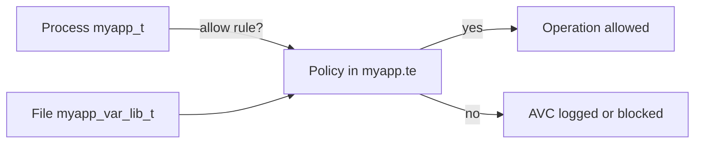

# SELinux Basics

This guide explains **SELinux from zero** using the `myapp` **reference application** that ships with **SELinux PaC**. No prior experience required.

**How to read this guide (about 15–20 minutes reading):**

1. Sections 1–4 — what SELinux is and how **labels** work (start here)
2. Sections 5–7 — **commands** to view labels, **policy files** (`.te`/`.fc`), **`restorecon`**, and the **two-layer model** (OS Enforcing + permissive app domain)
3. Section 7.5 — **soak** timeline (why production waits 7–14 days)
4. Sections 8–10 — **AVC denials**, export filtering, and a **worked example** on `myapp`
5. Sections 11+ — reference tables, cheat sheet, and admin runbooks

**Optional labs:** [SELINUX_TRAINING_LAB.md](../training/SELINUX_TRAINING_LAB.md). **Ship path:** [PRODUCTION_READINESS.md](../admin/PRODUCTION_READINESS.md). **All documentation:** [docs/README.md](../README.md).

### Where to run commands in this guide

| What you are doing | Where |
|--------------------|--------|
| Reading sections 1–7 | Anywhere — no Linux required |
| **`getenforce`**, **`ls -Z`**, **`semanage permissive`**, Labs in [SELINUX_TRAINING_LAB.md](../training/SELINUX_TRAINING_LAB.md) | **Linux with SELinux** (rhel-qa, cloud instance, or other RHEL/Fedora host) |
| **`make check`**, reading `.te` files | **Repo root** on your laptop |

macOS: you never run SELinux commands on the Mac itself — use [SELINUX_TRAINING_LAB.md — Running on macOS](../training/SELINUX_TRAINING_LAB.md#running-on-macos).

---

## 1. What is SELinux?

**SELinux** (Security-Enhanced Linux) is a kernel security layer that adds **mandatory access control** on top of normal Unix file permissions (`chmod`, owner, group).

| Unix permissions ask… | SELinux asks… |
|----------------------|---------------|
| "Can user `myapp` read this file?" | "Can a process labeled **`myapp_t`** write to a file labeled **`myapp_var_lib_t`**?" |
| The file owner decides (within limits) | **Policy** decides — rules are defined by admins and shipped as modules |
| Tools: `chmod`, `chown` | Tools: `.te` rules, `.fc` path labels, `restorecon`, `semodule` |

**Why it exists:** if an attacker compromises the app, SELinux still limits which files, ports, and processes that code can touch — independent of Unix ownership.

On RHEL, Fedora, and CentOS Stream, SELinux is **on by default**.

---

## 2. Labels — the core idea

Think of SELinux labels like **badges and room signs**:

| Real-world idea | SELinux equivalent | Example in this repo |
|-----------------|-------------------|----------------------|
| Employee badge color | **Process type** (domain) | `myapp_t` — the running Flask app |
| Sign on a door | **File/directory type** | `myapp_var_lib_t` — files under `/var/lib/myapp`; `myapp_var_run_t` — runtime under `/run/myapp` |
| Company access policy | **`allow` rules** in `.te` | "Processes with badge `myapp_t` may write to rooms labeled `myapp_var_lib_t`" |

**Key facts for beginners:**

- **Every running process** has a label — see it with `ps -eZ`.
- **Every file and directory** has a label — see it with `ls -Z`.
- On each operation, the kernel checks: *"Does policy allow this **source type** to do **permission** on this **target type**?"*
- If no rule allows it → **denied** (in Enforcing mode), or **logged only** (if that process domain is permissive).



### Vocabulary (used everywhere)

| Term | Plain English | In this repo |
|------|---------------|--------------|
| **Label / context** | The SELinux tag on a process or object | e.g. `system_u:system_r:myapp_t:s0` |
| **Type** | The most important part of a label; names a category | `myapp_t`, `myapp_exec_t`, `myapp_var_lib_t` |
| **Domain** | Word for a **process** type | `myapp_t` when the app is running |
| **Object class** | Kind of thing being accessed | `file`, `dir`, `tcp_socket`, `process` |
| **Allow rule** | Explicit permission in policy | `allow myapp_t myapp_var_lib_t:file write;` |
| **AVC** | Log line when access is denied (or would be) | Lines in `/var/log/audit/audit.log` |

**Domain vs type:** people say "domain" for process types like `myapp_t`. Technically a domain is still a *type* — it is the type of a running process.

---

## 3. The context string — four parts (focus on `type`)

A full SELinux context looks like this:

```text
user : role : type : level
system_u : system_r : myapp_t : s0
│          │          │        └── level (see below)
│          │          └── TYPE — the part you care about most
│          └── role (processes use system_r; files use object_r)
└── SELinux user (almost always system_u)
```

### What you can ignore in this project

| Part | Typical value | Do beginners need it? |
|------|---------------|------------------------|
| user | `system_u` | No — same on almost everything |
| role | `system_r` (process) / `object_r` (file) | No — notice files vs processes differ |
| **type** | `myapp_t`, `myapp_var_lib_t`, … | **Yes — this is what policy rules use** |
| level | `s0` | Mostly no — see below |

### What is `s0`? (MLS/MCS in plain English)

The last field (`s0`) is the **sensitivity/category level**.

- **`s0`** means "default" — no special clearance or compartment. **This demo uses only `s0`.**
- **MLS/MCS** (Multi-Level / Multi-Category Security) is an advanced RHEL feature for classified or multi-tenant environments. **We do not use it in this project.**

**Beginner rule:** when reading labels, look at the **third field** (`myapp_t`, `myapp_exec_t`, …). Treat `:s0` as normal and ignore it unless your org uses MLS.

---

## 4. Two commands that show labels

The `-Z` flag (capital **Z**) asks tools to print SELinux contexts. **Files and processes are labeled separately.**

| Command | Shows labels on | Use when |
|---------|-----------------|----------|
| `ls -Z PATH` | **Files and directories** | "What type is this log file / binary?" |
| `ps -eZ \| grep myapp` | **Running processes** | "What domain is my app running in?" |

These answer **different questions**. Do not confuse the process label with the file label.

### Example output (annotated)

```bash
$ ls -Z /opt/myapp/app.py
system_u:object_r:myapp_exec_t:s0    /opt/myapp/app.py
#                      ^^^^^^^^^^^^
#                      FILE type — entrypoint the kernel executes

$ ls -Z /var/log/myapp/data.log
system_u:object_r:myapp_log_t:s0    /var/log/myapp/data.log
#                      ^^^^^^^^^^^
#                      FILE type — application log (dedicated log type)

$ ps -eZ | grep -E 'app.py|myapp'
system_u:system_r:myapp_t:s0    1234 ?  ... python /opt/myapp/app.py
#                  ^^^^^^^
#                  PROCESS domain — the running app
```

**Takeaway:** the same application uses **`myapp_t`** when running, **`myapp_var_lib_t`** on state under `/var/lib/myapp`, and **`myapp_log_t`** on logs under `/var/log/myapp`. Policy must **explicitly allow** each access. Having Unix write permission (`chmod`) is not enough.

**Tip:** `-Z` is SELinux (capital Z). Lowercase `-z` on `ls`/`ps` means something else — do not mix them up.

---

## 5. Policy module pipeline — `.te`, `.fc`, and `.pp`

Policy is shipped as a **module**. In Git you edit source files; on the server you install a compiled package.

| File | Analogy | Answers the question… |
|------|---------|----------------------|
| **`myapp.te`** | Rule book | *Can `myapp_t` do X to `myapp_var_lib_t`?* |
| **`myapp.fc`** | Address book | *What label should `/var/log/myapp/data.log` get?* |
| **`myapp.pp`** | Installed package | Binary loaded into the kernel with `semodule -i` (CI-built artifact — not committed) |

```text
selinux/myapp.te  ──┐
                    ├── refpolicy Makefile compile ──► myapp.pp ── semodule -i ──► active kernel policy
selinux/myapp.fc  ──┘
```

- You **commit** `.te` and `.fc` to Git (source of truth).
- CI/playbooks **compile** them to `.pp` via the refpolicy Makefile (`scripts/compile_and_validate.sh`; `checkmodule` fallback when devel Makefile is absent). The compiled `.pp` is uploaded as a CI artifact — it is **not** tracked in Git.
- CI also runs **`validate_policy_semantics.sh`** (`sesearch` assertions on the compiled module).
- Admins **install** `.pp` on staging/production hosts (`semodule -i` upgrades in place). Packaged delivery: [`packaging/myapp-selinux.spec`](../../packaging/myapp-selinux.spec).

### Type Enforcement (`.te`) — permission rules

From [`selinux/myapp.te`](../../selinux/myapp.te):

```text
type myapp_t;              # declare process domain
type myapp_var_lib_t;      # declare data file type

# Can myapp_t write to myapp_var_lib_t files?
allow myapp_t myapp_var_lib_t:file { create write append ... };

# Can myapp_t bind port 8888? dedicated type, not http_port_t / unreserved_port_t
allow myapp_t myapp_port_t:tcp_socket name_bind;

# systemd starts app → process transitions into myapp_t
init_daemon_domain(myapp_t, myapp_exec_t);
```

- **`allow SOURCE TARGET:CLASS { permissions }`** — basic building block.
- **`init_daemon_domain`** — standard pattern for systemd services.
- **`require { type ... }`** — types defined in the **base** RHEL policy that you reference but do not create.

Optional training labs use a minimal [`selinux/stub/myapp.te`](../../selinux/stub/myapp.te) with `permissive myapp_t;`. The customer two-host talk does **not** overlay that folder — it runs the app unconfined first, then `write_domain_seed.sh` so the next curls produce `myapp_t` AVCs, then generates the first real `.te`.

### File contexts (`.fc`) — path → label mapping

From [`selinux/myapp.fc`](../../selinux/myapp.fc):

```text
/opt/myapp/app\.py     -- gen_context(system_u:object_r:myapp_exec_t,s0)
/var/lib/myapp(/.*)?   -- gen_context(system_u:object_r:myapp_var_lib_t,s0)
/run/myapp(/.*)?       -- gen_context(system_u:object_r:myapp_var_run_t,s0)
/var/run/myapp(/.*)?   -- gen_context(system_u:object_r:myapp_var_run_t,s0)
/opt/myapp/bin/.*      -- gen_context(system_u:object_r:myapp_script_exec_t,s0)
```

- Each line says: *files matching this path pattern get this default label*.
- **FCOS note:** `/var/opt/myapp/*` entries exist because on Fedora CoreOS `/opt` is a symlink; paths must match where files actually live. After `semodule -i`, run **`restorecon`** — `.fc` is the source of truth (no manual `chcon`).

**`.te` vs `.fc` in one sentence:** `.fc` assigns labels to paths; `.te` defines what processes with those labels may do to each other.

---

## 6. What `restorecon` does (and why it matters)

Installing policy updates **rules for new files**, but **existing files on disk** may still have **old labels** from before the module was installed.

### The problem (mislabeled file)

```bash
# What policy SAYS the label should be:
$ matchpathcon /var/log/myapp/data.log
/var/log/myapp/data.log    system_u:object_r:myapp_log_t:s0

# What is ACTUALLY on disk (wrong — e.g. still generic var_log_t):
$ ls -Z /var/log/myapp/data.log
system_u:object_r:var_log_t:s0    /var/log/myapp/data.log
```

The app runs as `myapp_t` and tries to write the file. Policy allows `myapp_t` → `myapp_log_t`, **not** `myapp_t` → `var_log_t`. Result: **denial** even though `chmod` looks fine.

### The fix

```bash
$ sudo restorecon -Rv /var/lib/myapp /var/log/myapp /run/myapp /opt/myapp

$ ls -Z /var/log/myapp/data.log
system_u:object_r:myapp_log_t:s0    /var/log/myapp/data.log
```

**`restorecon`** = "**restore** security **con**texts" — re-apply labels from policy to files on disk.

| Flag | Meaning |
|------|---------|
| `-R` | Recursive (directories) |
| `-v` | Verbose — print each path changed |
| `-n` | **Dry run** — show what *would* change, change nothing |

This repo runs `restorecon` in Ansible canary/enforce playbooks and checks with [`scripts/verify_file_contexts.sh`](../../scripts/verify_file_contexts.sh) (`restorecon -Rv -n` must show no changes before restart).

**When to run it:** immediately after `semodule -i myapp.pp`, before `systemctl restart myapp`.

---

## 7. Enforcing vs permissive — and `semanage` commands

### Whole-system mode

```bash
$ getenforce
Enforcing
```

| Mode | What happens on denial |
|------|------------------------|
| **Enforcing** | Operation **blocked** + logged |
| **Permissive** | Operation **allowed** + logged (whole OS — avoid in prod) |
| **Disabled** | SELinux off — do not use in production |

### Per-domain permissive (what SELinux PaC uses)

You can keep the **OS Enforcing** but mark **one app domain** as permissive:

| Command | What it does | When |
|---------|--------------|------|
| `sudo semanage permissive -a myapp_t` | **Add** `myapp_t` to permissive list | Start canary / soak |
| `sudo semanage permissive -l` | **List** all permissive domains | Check current state |
| `sudo semanage permissive -d myapp_t` | **Remove** `myapp_t` from list | Production enforce |

**This is not `setenforce 0`.** The rest of the system stays protected; only processes in `myapp_t` get log-only denials.

### The two-layer model (Enforcing OS + permissive app domain)

This repo uses **two separate checks**. Beginners often confuse them:

| Check | Command | What it tells you |
|-------|---------|-------------------|
| **Whole-system mode** | `getenforce` | Is SELinux enforcing **globally**? (Always **Enforcing** in SELinux PaC.) |
| **Per-domain log-only list** | `sudo semanage permissive -l` | Which **process types** get log-only denials? (Usually **`myapp_t`** during staging/soak.) |

```text
Host state during staging and soak:
  getenforce          →  Enforcing     (SSH, cron, systemd, etc. stay fully protected)
  semanage permissive -l  →  myapp_t   (Flask app domain: deny → log only, app keeps running)
  ps -eZ | grep app   →  myapp_t       (running Flask process label)
```

**What this means in plain English:**

- **`sshd_t`**, **`init_t`**, **`cron_t`**, and every other domain stay **enforcing** — a denial blocks the operation.
- Only **`myapp_t`** (the Flask app) is on the permissive list — denials are **logged** but the app **keeps working**.
- We **never** run `setenforce 0` (whole-OS permissive) in production workflows.

#### Example: `-a` vs `-l`

```bash
$ getenforce
Enforcing

$ sudo semanage permissive -a myapp_t
# (no output on success — that is normal)

$ sudo semanage permissive -l
myapp_t

# ... after soak, admin enforces:

$ sudo semanage permissive -d myapp_t

$ sudo semanage permissive -l
# (empty output — no domains listed)
```

**Summary:**

- **`-a`** = turn on log-only mode **for one domain** (action / change)
- **`-l`** = show who is currently in that log-only list (read / inspect)
- **`-d`** = turn log-only mode off for that domain (enforce)

### Two permissive phases (do not confuse them)

| Phase | When | Policy on host | Why `myapp_t` is permissive |
|-------|------|----------------|----------------------------|
| **Staging discovery** | Demo Acts 1–2, `dev_generate_policy.sh` | Stub or minimal module | Run tests, collect AVC evidence, AI writes `.te` |
| **Canary soak** | Demo Acts 6–8, production rollout | **Full** `myapp.pp` installed | Real policy loaded; watch 7–14 days for missed edge cases before enforce |

Both phases keep `getenforce` = **Enforcing**. Only **`myapp_t`** is log-only.

---

## 7.5 What soak means (production)

**Soak** = run the app with **real policy installed** but **`myapp_t` still permissive** for **7–14 days**, watching for new AVC surprises (weekly cron, logrotate, cert renewals, restarts).

```text
Day 0   Canary deploy
        → semodule -i myapp.pp
        → semanage permissive -a myapp_t
        → write marker: /var/lib/myapp/selinux_canary_deployed_at
        → semodule -DB (disable dontaudit during soak)

Days 1–14   Soak (production)
        → app keeps running; myapp_t still log-only
        → daily: AAP **SELinux – Soak monitor** (`soak_monitor.yml`, net-new vs installed policy)
        → goal: zero **net-new** access needs (not zero raw AVC lines)
        → if net-new appears: [DENIAL_RESPONSE.md](../admin/DENIAL_RESPONSE.md) (PR, not live patch)

Enforce gate   Ansible collect_soak_facts / soak_status must pass ALL:
        → marker age ≥ 7 days
        → net-new count for myapp_t since marker ≤ 0 (raw AVC if sesearch missing)
        → deploy report at /var/lib/myapp/selinux_deploy_report.json with pass + endpoint coverage

Enforce   semanage permissive -d myapp_t
        → denials now BLOCK the app if policy is incomplete
        → getenforce still Enforcing (only myapp_t changed)
```

| Artifact | Purpose |
|----------|---------|
| `/var/lib/myapp/selinux_canary_deployed_at` | Epoch timestamp — soak clock starts here |
| `/var/lib/myapp/selinux_soak_last_fail.json` | Last soak-monitor fail (copy to rhel-qa; see [DENIAL_RESPONSE.md](../admin/DENIAL_RESPONSE.md)) |
| `ansible/soak_monitor.yml` | Daily AAP **Soak monitor** — fail if **net-new** needs remain |
| `ansible/soak_status.yml` / `collect_soak_facts.sh` | First node of **Promote to enforce** |

**"Zero AVCs during soak"** in this repo means no **net-new access needs** vs the **installed** canary module (duplicate log lines from cron do not fail the gate). It does **not** mean the audit log is empty globally.

If policy changes mid-soak, redeploy canary and **reset the soak clock**. Full admin runbook: [PRODUCTION_READINESS.md §6–12](../admin/PRODUCTION_READINESS.md). Ansible hub: [ANSIBLE_OPERATIONS.md](../admin/ANSIBLE_OPERATIONS.md). Prod AVC: [DENIAL_RESPONSE.md](../admin/DENIAL_RESPONSE.md).

---

## 8. AVC denials — evidence for policy updates

When SELinux blocks (or would block) access, the kernel logs an **AVC** (Access Vector Cache) line:

```text
type=AVC msg=audit(1234567890.123:456): avc: denied { write } for pid=1234 comm="python3"
  scontext=system_u:system_r:myapp_t:s0
  tcontext=system_u:object_r:myapp_var_lib_t:s0
  tclass=file permissive=1
```

| Field | Meaning |
|-------|---------|
| `denied { write }` | Operation that was blocked (or logged) |
| `scontext` | **Source** — process type (`myapp_t`) |
| `tcontext` | **Target** — object type (`myapp_var_lib_t`) |
| `tclass=file` | Object class |
| `permissive=1` | Domain was permissive — app kept running; denial was logged |

Search recent denials:

```bash
sudo ausearch -m avc -ts recent
sudo ausearch -m avc -ts recent | grep myapp_t
```

### What goes into `policy_out/avc.log`

**Important:** `avc.log` does **not** contain every SELinux denial on the host.

Export scripts filter the audit log to **app-related evidence only**:

```bash
# Simplified from the AVC export used by scripts/dev_generate_policy.sh
ausearch -m avc -ts boot --raw | grep -E "myapp|/opt/myapp|/var/lib/myapp|/run/myapp"
```

| Included in `avc.log` | Not included |
|-------------------------|--------------|
| Denials where **`myapp_t`** is the source (`scontext`) | Denials for **`sshd_t`**, **`init_t`**, other domains |
| Lines mentioning **`/opt/myapp`**, **`/var/lib/myapp`**, or **`/run/myapp`** paths | Unrelated system AVCs |

So: the host audit log records **all** domains; **`policy_out/avc.log`** is filtered input for **this app's policy update** — not a full-server security report.

This repo exports matching lines to `policy_out/avc.log` (raw audit trail for PR review) and feeds a **processed** summary to the AI CLI — instead of blindly running `audit2allow`, which often creates over-broad rules.

### Raw log vs processed summary

| File | Purpose |
|------|---------|
| `policy_out/avc.log` | Raw AVC lines from `ausearch` — kept for audit and PR excerpts |
| `policy_out/avc_summary.txt` | Merged, deduped access needs sent to the LLM |

Before calling the LLM, `cli/selinux_gen.py` (via [`cli/avc_preprocess.py`](../../cli/avc_preprocess.py)):

1. **Merge** — combine duplicate lines that share the same source type, target type, and object class (union permissions)
2. **Subtract** — drop permissions already allowed in the existing `.te` file
3. **Structure** — send net-new needs as a table, not repetitive raw AVC bullets

Example: 42 raw lines may collapse to 6 merged rows, with only 2 net-new after subtracting existing policy.

---

## 9. Worked example — `/save-log` end to end

This ties labels, `.te`, `.fc`, AVCs, and the reference app together.

The Flask app ([`app/app.py`](../../app/app.py)) exposes `GET /save-log`, which appends a line to `/var/log/myapp/data.log` (created by systemd `LogsDirectory=myapp`).

### Step 0 — Confirm two-layer SELinux state

Before hitting the endpoint, verify the host is Enforcing but the app domain is log-only:

```bash
$ getenforce
Enforcing

$ sudo semanage permissive -l
myapp_t
```

SSH and other services stay enforcing; only the Flask process domain is permissive.

### Step 1 — Process and file labels

```bash
$ ps -eZ | grep app.py
system_u:system_r:myapp_t:s0    ... python /opt/myapp/app.py

$ ls -Z /var/log/myapp/data.log
system_u:object_r:myapp_log_t:s0    /var/log/myapp/data.log
```

Process is `myapp_t`. File is `myapp_log_t`. Good — labels match what policy expects **if** `.fc`, `logging_log_filetrans()`, and `restorecon` were applied.

### Step 2 — Policy must allow the write

In [`selinux/myapp.te`](../../selinux/myapp.te):

```text
logging_log_filetrans(myapp_t, myapp_log_t, file)
allow myapp_t myapp_log_t:file { create write append open ... };
```

Without these rules, SELinux denies the write even when Unix permissions allow it.

### Step 3 — If rule is missing → AVC

```text
avc: denied { write } ...
  scontext=...:myapp_t:s0
  tcontext=...:myapp_log_t:s0
  tclass=file permissive=1
```

Read it as: **`myapp_t` tried to `write` a `file` labeled `myapp_log_t` — not allowed.**

During soak (`semanage permissive -a myapp_t`), the write **still succeeds**; the line is **evidence** for policy authors.

### Step 4 — Demo pipeline picks it up

```text
integration probes (all HTTP paths)  →  export to policy_out/avc.log  →  merge into selinux/myapp.te  →  PR + CI  →  canary  →  soak  →  enforce
```

Same pattern applies to `/run-script` (execute `myapp_script_exec_t`), `/rotate-log` (rename/create under `myapp_log_t`), `/probe-backend` (outbound TCP to `myapp_backend_t` on port 8889), and `/notify-socket` (Unix stream to `/run/myapp/notify.sock`).

### Tier 6 network endpoints (policy v1.1.1+)

These endpoints exercise **cross-domain** rules between Flask (`myapp_t`) and the backend stub (`myapp_backend_t`):

| Endpoint | Client domain | Server / target | Typical net-new allows |
|----------|---------------|-----------------|------------------------|
| `/probe-backend` | `myapp_t` | `myapp_backend_t` on TCP **8889** | `connectto`; `self:tcp_socket getopt`; read-only `cert_t` for `urllib` |
| `/notify-socket` | `myapp_t` | `myapp_backend_t` on `/run/myapp/notify.sock` | `unix_stream_socket connectto`; backend needs `myapp_var_run_t:dir remove_name` to replace stale sockets |

**Backend process:** `systemd` starts `/opt/myapp/backend_stub.py` (labeled `myapp_backend_exec_t`) → `init_daemon_domain(myapp_backend_t, ...)` → listener on `:8889` and Unix socket under `/run/myapp`.

**Script pitfall:** `backup.sh` must not call `/usr/bin/date`, `mkdir`, or other **`bin_t`** helpers — CI rejects `allow ... bin_t:file execute`. Use bash builtins (e.g. `printf '%(%Y-%m-%dT%H:%M:%SZ)T' -1`) and append to `/var/log/myapp/backup.log` only.

---

## 10. How the app process gets type `myapp_t`

Processes do not choose their own label. The kernel assigns a type based on **how the process starts** and **policy transition rules**.

```text
systemd (runs as init_t)
    → starts /opt/myapp/venv/bin/python /opt/myapp/app.py
    → binary path labeled myapp_exec_t (.fc + restorecon)
    → init_daemon_domain() transition in .te
    → running process labeled myapp_t
```

If you start the app manually as root (`python app.py`) instead of **`systemctl restart myapp`**, you may get a **different domain** and **different AVCs** than production. The demo playbooks always restart via systemd for this reason.

**Script execution:** `GET /run-script` runs `backup.sh` labeled `myapp_script_exec_t`. Policy uses `domain_auto_trans(..., myapp_t)` so the process **remains `myapp_t`** — not a separate backup helper domain. The script intentionally avoids external `/usr/bin/*` binaries so policy stays within forbidden-pattern CI limits.

**Backend execution:** `myapp-backend.service` starts `backend_stub.py` labeled `myapp_backend_exec_t` → running process is **`myapp_backend_t`**. Flask connects to it over TCP **8889** and the Unix socket at `/run/myapp/notify.sock`.

---

## 11. Types in the myapp module (quick reference)

| Type | Used for |
|------|----------|
| `myapp_t` | Running Flask app (process domain) |
| `myapp_exec_t` | App binary, Python venv (entrypoint) |
| `myapp_var_lib_t` | State under `/var/lib/myapp` (soak marker, deploy report) |
| `myapp_log_t` | Logs under `/var/log/myapp` (`data.log`, rotated files) |
| `myapp_var_run_t` | Runtime under `/run/myapp` (`notify.sock`; `files_pid_file`) |
| `myapp_port_t` | TCP port **8888** (Flask bind) |
| `myapp_backend_port_t` | TCP port **8889** (backend bind) |
| `myapp_script_exec_t` | `backup.sh` and scripts in `/opt/myapp/bin/` |
| `myapp_backend_t` | Running backend stub (`backend_stub.py`) |
| `myapp_backend_exec_t` | Backend entrypoint (`/opt/myapp/backend_stub.py`) |

---

## 12. How this maps to the SELinux PaC workflow

```text
1. Run app as myapp_t (permissive)     →  AVCs logged, app still works
2. Export AVCs                         →  policy_out/avc.log
3. Generate policy                     →  selinux/myapp.te + .fc updates
4. Review + CI                         →  no wildcards / no shadow_t allows
5. Canary deploy                       →  AAP **Release canary** (semodule -i + permissive domain)
6. Soak + monitor                      →  AAP **Soak monitor** (net-new); fail → DENIAL_RESPONSE.md
7. Enforce                             →  AAP **Promote to enforce** (`change_ticket`)
8. Deploy verification                 →  wait_for_endpoints.sh + selinux_deploy_report.json
9. Outage?                             →  AAP **Rollback**, then PR (not live semodule -i)
```

**Deploy verification:** after canary, enforce, or rollback, playbooks run `scripts/wait_for_endpoints.sh` (HTTP probes from the manifest **plus domain-context check**) and write a deploy report JSON. Enforce uses Ansible **block/rescue** — on failure, the app domain is restored to permissive before the playbook exits. Production soak uses AAP **Soak monitor** (`soak_monitor.yml`, net-new vs installed policy). Prod AVC: [DENIAL_RESPONSE.md](../admin/DENIAL_RESPONSE.md).

### App-visible SELinux signals

The reference app exposes SELinux state so app teams can distinguish policy issues from application bugs:

- **`GET /`** health JSON includes `"selinux": { "mode", "domain", "domain_permissive", "policy_version" }`
- Permission errors may include `"selinux_context"` alongside `"Permission denied"`

Full triage steps for app teams: [PRODUCTION_READINESS.md §12.5](../admin/PRODUCTION_READINESS.md).

Presenter steps: [DEMO_GUIDE.md](../training/DEMO_GUIDE.md). Admin gates: [PRODUCTION_READINESS.md](../admin/PRODUCTION_READINESS.md). Principles and anti-patterns: [SELINUX_BEST_PRACTICES.md](SELINUX_BEST_PRACTICES.md).

---

## 13. Common beginner mistakes

| Mistake | Why it hurts | What this repo does |
|---------|--------------|---------------------|
| Confusing process and file labels | Wrong mental model for AVCs | Use `ps -eZ` vs `ls -Z` (section 4) |
| Setting entire OS permissive (`setenforce 0`) | Removes protection for everything | Only `myapp_t` permissive during soak |
| Using `audit2allow` blindly | Over-broad rules (`allow myapp_t *:*`) | AI + forbidden-pattern CI + human review |
| Allowing `bin_t:file execute` for helper scripts | CI rejects; over-broad | Keep `backup.sh` on bash builtins only |
| Skipping `restorecon` after deploy | Old files keep wrong types | `verify_file_contexts.sh`, Ansible playbooks |
| Testing only manual `python app.py` | Missing systemd transition AVCs | Playbooks restart via **systemd** |
| Wrong port type for 8888 | `http_port_t` / raw `unreserved_port_t` | Dedicated **`myapp_port_t`** + `seport` |
| Enforcing immediately | Misses weekly cron / logrotate edge cases | **7–14 day soak** before enforce |

---

## 14. Install and manage policy modules

```bash
# Compile (this repo — refpolicy Makefile)
bash scripts/compile_and_validate.sh selinux

# Semantic checks on rhel-qa
bash scripts/validate_policy_semantics.sh selinux

# Install / upgrade on host (in-place — no semodule -r step)
sudo semodule -i selinux/myapp.pp

# List loaded modules
sudo semodule -l | grep myapp
```

---

## 14.5 Production topics (beyond the reference app)

This demo focuses on custom types, `.te` allows, canary soak, and enforce. Real RHEL apps often also need:

### auditd (AVC source)

| Command | Purpose |
|---------|---------|
| `systemctl status auditd` | Confirm denial logging is on |
| `ausearch -m avc -ts recent` | Query structured AVC events |
| `grep '^type=AVC' /var/log/audit/audit.log` | Raw log fallback |

Export scripts prefer `ausearch`; if auditd is stopped, `policy_out/avc.log` will be empty.

### SELinux booleans

Booleans toggle optional base-policy behavior without a custom module:

```bash
getsebool -a | head
semanage boolean -l | head
```

This repo uses **custom `.te` rules** instead of toggling booleans (e.g. `httpd_can_network_connect`). A boolean is only the right fix when base policy already has one — the generator says so.

### Port labeling (`semanage port`)

Port **8888** is labeled **`myapp_port_t`** (`semanage port` / canary `seport`) — not `http_port_t` and not a blanket `unreserved_port_t` bind. Before that label exists, AVCs still name `unreserved_port_t`; that is the *denial*, not the intended allow.

### Process transitions

`domain_auto_trans(myapp_t, myapp_script_exec_t, myapp_t)` keeps `backup.sh` in **`myapp_t`** — not a separate helper domain.

`init_daemon_domain(myapp_backend_t, myapp_backend_exec_t)` gives the backend stub its own domain for Tier 6 TCP/Unix rules.

---

## 15. Command cheat sheet (by task)

**Check SELinux status**

```bash
getenforce
sestatus
```

**View labels**

```bash
ls -Z /path/to/file          # file label
ps -eZ | grep myapp          # process label
matchpathcon /path/to/file   # label policy expects
```

**Fix labels on disk**

```bash
sudo restorecon -Rv /opt/myapp /var/lib/myapp /var/log/myapp /run/myapp
sudo restorecon -Rv -n /var/log/myapp    # dry run only
```

**Permissive domain (one app)**

```bash
sudo semanage permissive -a myapp_t   # add — start soak
sudo semanage permissive -l           # list — inspect
sudo semanage permissive -d myapp_t   # delete — enforce
```

**Audit / denials**

```bash
sudo systemctl status auditd          # must be active for AVC export
sudo ausearch -m avc -ts recent
sudo ausearch -m avc -ts recent | grep myapp_t
```

If `auditd` is stopped, `policy_out/avc.log` export will be empty even when the app runs.

**Policy modules**

```bash
sudo semodule -l
bash scripts/compile_and_validate.sh selinux   # build myapp.pp locally
sudo semodule -i selinux/myapp.pp              # upgrades in place
```

---

## 16. Glossary

| Term | One-line definition |
|------|---------------------|
| **MAC** | Mandatory Access Control — system policy, not user choice |
| **Label / context** | SELinux tag on a process or object (`user:role:type:level`) |
| **Type** | Third field of a context; used in `allow` rules |
| **Domain** | Process type (e.g. `myapp_t`) |
| **TE** | Type Enforcement — rule language in `.te` files |
| **FC** | File Contexts — path-to-label mappings in `.fc` files |
| **AVC** | Access Vector Cache denial log entry |
| **restorecon** | Re-apply policy-defined labels to files on disk |
| **semanage** | Manage SELinux settings (including per-domain permissive list) |
| **DAC** | Discretionary Access Control — classic Unix `rwx` permissions |
| **MLS/MCS** | Advanced classification; not used in this project (always `s0`) |

---

## 17. Further reading

- [Red Hat SELinux User's and Administrator's Guide](https://access.redhat.com/documentation/en-us/red_hat_enterprise_linux/8/html/using_selinux/index)
- On RHEL hosts: `man selinux`, `man semodule`, `man restorecon`, `man ausearch`

---

## Document map

| Guide | Audience |
|-------|----------|
| **This file** | New to SELinux — labels, `.te`/`.fc`, commands with examples |
| [SELINUX_TRAINING_LAB.md](../training/SELINUX_TRAINING_LAB.md) | Optional hands-on labs |
| [CODE_WALKTHROUGH.md](../training/CODE_WALKTHROUGH.md) | Code tour — CLI, scripts, PR CI |
| [DETERMINISTIC_POLICY.md](../developers/DETERMINISTIC_POLICY.md) | Default offline policy generator from AVCs |
| [DEMO_GUIDE.md](../training/DEMO_GUIDE.md) | Optional paced walkthrough |
| [TESTING.md](../developers/TESTING.md) | Endpoints, smoke tests, CI matrix |
| [PRODUCTION_READINESS.md](../admin/PRODUCTION_READINESS.md) | RHEL admins — soak, canary, enforce gates |
| [README.md](../../README.md) | Project overview and command index |
