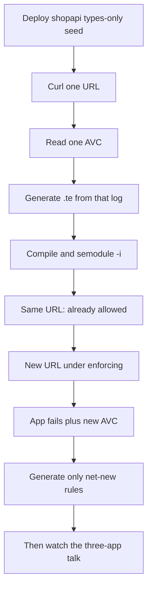

# 101 — SELinux 101 (commands before the demo)

Finish this guide **before** the three-app talk (**[202](202-DEMO_GUIDE.md)**). The talk is short because it assumes you can already: read a label, decode one AVC, generate a module from that log, load it, see that the **same** denial is not added again, then watch a **new** URL fail under enforcing and fix only the net-new rule.

This page is that practice. One app (**shopapi**), one RHEL box, typed commands. It is not the customer talk and not the two-host AAP pipeline.



| | |
|--|--|
| **Who** | Little or no SELinux. You will watch App A / App B / shopapi afterward. |
| **Where** | One RHEL host with SELinux (**rhel-qa**). macOS has no `ausearch` / `semodule`. |
| **Time** | About **60–90 minutes** on RHEL. Laptop appendix: about **20 minutes**, no kernel. |
| **App** | Spring Boot **shopapi** — the same JVM as the talk. |

**Hard rule:** before the first generate, curl **only** the URL the lab names. **`/feature-spool` is lab 5.** If you already ran the full demo, restore the types-only seed first (prep below).

**Prod vs this 101:** production ships a signed RPM and Ansible — not `semodule -i` on the box. Here you load the module on QA so you can *see* it take effect. Do not copy that install habit onto prod. Do not `setenforce 0`. Do not pipe `audit2allow` into `semodule`.

---

## Prep (once)

SSH to the SELinux host. Repo root = directory with `Makefile` and `scripts/`.

```bash
cd ~/selinux-pac   # or your clone path
sudo bash scripts/demo_bootstrap.sh --shopapi-only
```

That installs the JVM, a `shopapi_exec_t` launcher at `/opt/shopapi/bin/java`, `SELinuxContext=shopapi_t`, the **types-only** seed, and `semanage permissive -a shopapi_t`. The **host** stays Enforcing. Only the **app domain** logs denials instead of blocking (labs 1–4).

Already generated on this box? Put the seed back, then bootstrap again:

```bash
git checkout -- selinux/shopapi/
sudo bash scripts/demo_bootstrap.sh --shopapi-only
```

Need two VMs from a Mac first? [203-RHEL_TWO_HOST.md](../admin/203-RHEL_TWO_HOST.md). Run every command in this 101 **on rhel-qa**, not in macOS Terminal.

---

## Lab 0 — Words (about 10 minutes)

**Why:** every later lab is “this **type** tried to do **this permission** to **that type**.” If the third field of a label is fuzzy, the AVC will look like noise.

**Read:** **[102](../policy/102-SELINUX_BASICS.md)** §1–4 (labels, the four-part context, `ls -Z` vs `ps -eZ`).

**Type this** (optional, on rhel-qa):

```bash
getenforce
ls -Z /opt/shopapi | head
ps -eZ | grep shopapi
```

**Good sign**

| Command | Shape of a good answer |
|---------|------------------------|
| `getenforce` | `Enforcing` — we never turn the host off |
| `ls -Z` | A line with `system_u:object_r:`**`shopapi_exec_t`**`:s0` (file **type**, third field) |
| `ps -eZ` | A java line with `system_u:system_r:`**`shopapi_t`**`:s0` (process **domain**) |

**Checkpoint:** What is the difference between the type on the **file** and the type on the **running process**? (File = room sign. Process = badge. Policy matches badge → room.)

---

## Lab 1 — Deploy (the seed is not a permission list)

**Why:** the talk will say “types-only seed, then allows come from AVCs.” You should have seen that file with your own eyes.

**Type this:**

```bash
systemctl status shopapi --no-pager
ps -o label=,args= -C java | head
sed -n '1,32p' selinux/shopapi/shopapi.te
```

**Good sign**

- Unit is **active**.
- Process label is **`shopapi_t`** (after the seed is loaded). If you still see `unconfined_service_t` / `unconfined_java_t`, the seed did not load — re-run bootstrap.
- [`selinux/shopapi/shopapi.te`](../../selinux/shopapi/shopapi.te) declares types (`shopapi_t`, `shopapi_log_t`, …) and `init_daemon_domain(...)`. It does **not** yet list first-ship `allow` lines for `/log` or `/var/spool`.

**Checkpoint:** If the `.te` has almost no `allow` lines, how can the app still answer HTTP while `shopapi_t` is **permissive**? (Denials are **logged**; the kernel does not block that domain.)

---

## Lab 2 — One test, one AVC

**Why:** the demo flashes `ausearch` and moves on. You need to read **one** line slowly.

**Type this — `/log` only. Do not curl `/health`, `/state`, or `/feature-spool` yet.**

```bash
curl -sf http://127.0.0.1:8091/log
echo
sudo ausearch -m avc -ts recent | grep shopapi_t | tail -n 20
```

You may see **more than one** line (JVM startup plus the log write). Pick **one** that you can explain. Optional: `sudo ausearch -m avc -ts recent | audit2why | tail -n 40` — that is the human-readable form. We still do not `audit2allow | semodule -i`.

**How to read one line** (ignore timestamps):

```text
avc:  denied  { write } for ... path="..." \
  scontext=...:shopapi_t:s0 \
  tcontext=...:var_log_t:s0 \
  tclass=file permissive=1
```

| Field | Meaning |
|-------|---------|
| `{ write }` | Permission that was not allowed |
| `scontext` … **`shopapi_t`** | Who (process domain) |
| `tcontext` … **type** | What it touched (file / port / …) |
| `tclass` | Kind of object (`file`, `dir`, `tcp_socket`, …) |
| `permissive=1` | Domain is log-only — the syscall **still succeeded** |

`permissive=0` means enforcing: the syscall **failed**. You should not see `0` until lab 5.

**Checkpoint:** In your chosen line, who is the process type, what is the target type, and what permission was missing?

---

## Lab 3 — Create policy and load it

**Why:** this is the first time you **author** policy. The talk declines the generator twice (App A covered, App B tuned) before this step. Shopapi has no vendor module, so pre-flight lets it through.

**Type this** from repo root (ausearch needs root; `policy_out/` may end up root-owned):

```bash
sudo bash scripts/dev_generate_policy.sh --apply --app-name shopapi --app-root "$(pwd)"
```

If generate **exits 1** and mentions `execmem` / `needs_review`, the JVM asked for a domain-weakening permission. The talk treats that as a CODEOWNERS decision. For this 101 only, continue with:

```bash
sudo bash scripts/dev_generate_policy.sh --apply --app-name shopapi --app-root "$(pwd)" --allow-needs-review
```

Do not add `execmem` by hand if it was **not** in the log.

**Look at**

```bash
python3 -m json.tool policy_out/findings.json | head -n 80
tail -n 40 policy_out/shopapi.te
```

`--apply` copies `policy_out/shopapi.te` and `.fc` into `selinux/shopapi/`. Then compile and load **on this QA box**:

```bash
POLICY_MODULE=shopapi SELINUX_DOMAIN=shopapi_t \
  bash scripts/compile_and_validate.sh selinux/shopapi
sudo semodule -i selinux/shopapi/shopapi.pp
sudo restorecon -Rv /opt/shopapi /var/lib/shopapi /var/log/shopapi
sudo semodule -l | grep shopapi
```

**Good sign:** `compile_and_validate` prints `Built …/shopapi.pp`. `semodule -l` lists `shopapi`. `findings.json` rows have verdicts (`direct`, `interface`, `fc_fix`, …) — not a dump of raw `audit2allow`.

**Checkpoint:** Where do the new `allow` lines come from — a JVM cookbook, or the AVC log you just exported?

---

## Lab 4 — Same test, no new rule

**Why:** soak and the generator both care about **net-new** access, not “were there log lines.” Duplicate `allow`s mean you are not tracking what policy already has.

**Type this:**

```bash
curl -sf http://127.0.0.1:8091/log
echo
sudo ausearch -m avc -ts recent | grep shopapi_t | tail -n 5
sudo bash scripts/dev_generate_policy.sh --apply --app-name shopapi --app-root "$(pwd)"
```

(Add `--allow-needs-review` only if lab 3 needed it.)

**Good sign**

- `/log` still returns **200**.
- `findings.json` for that same access is **`baseline`** / already allowed — **not** a second identical `allow` in `selinux/shopapi/shopapi.te`.
- `git diff selinux/shopapi/shopapi.te` should not grow a duplicate line for the lab 2 permission. (Startup noise can still add unrelated net-new rows; the point is the **`/log` write is not duplicated**.)

This is the same idea as “soak net-new is 0,” without Ansible.

**Checkpoint:** If the kernel logs the same denial again while the rule already exists, what should generate do?

---

## Lab 5 — New test fails (host stays Enforcing)

**Why:** the talk’s outage is `/feature-spool` **after** the first module is enforcing. The file is `/var/spool/shopapi/feature.log` — not in the first-ship module.

**Type this:**

```bash
sudo semanage permissive -d shopapi_t
sudo semanage permissive -l | grep shopapi || echo "(shopapi_t not on the permissive list — good)"
curl -sf http://127.0.0.1:8091/feature-spool; echo "exit=$?"
curl -sS http://127.0.0.1:8091/feature-spool || true
sudo ausearch -m avc -ts recent | grep shopapi_t | tail -n 15
```

**Good sign**

- `curl -sf` is **non-zero** (often HTTP 500). The app is confined, not “SELinux is off.”
- AVC lines show **`permissive=0`**.
- `getenforce` is still **`Enforcing`**. You did **not** run `setenforce 0`.

**Checkpoint:** Why did `/log` still work and `/feature-spool` fail? (First module covers the first URL. The spool path was never in that module.)

---

## Lab 6 — Update policy (only the new surface)

**Why:** a second generate should add **`/var/spool/shopapi`** (label + allow), not replay lab 3.

The lab 5 denials are already in the audit log. Generate from the host (same as lab 3):

```bash
sudo bash scripts/dev_generate_policy.sh --apply --app-name shopapi --app-root "$(pwd)"
POLICY_MODULE=shopapi SELINUX_DOMAIN=shopapi_t \
  bash scripts/compile_and_validate.sh selinux/shopapi
sudo semodule -i selinux/shopapi/shopapi.pp
sudo restorecon -Rv /var/spool/shopapi /opt/shopapi /var/lib/shopapi /var/log/shopapi
curl -sf http://127.0.0.1:8091/feature-spool
echo
```

(Again: `--allow-needs-review` only if generate blocks on `needs_review`.)

**Good sign**

- `/feature-spool` returns **200** under enforcing (`shopapi_t` still **not** permissive).
- New `.te` / `.fc` rows mention the spool path or its type — not a second copy of the lab 2 log allow.
- Optional third generate: still no duplicate of those rules.

**Checkpoint:** What is the difference between “there were AVCs in the log” and “net-new access the `.te` does not already allow”?

You can put the domain back in permissive if you will keep using this VM as a discovery box:

```bash
sudo semanage permissive -a shopapi_t
```

---

## Lab 7 — Map to the talk

You now have the skills the demo assumes. **Do not** run the full talk yet — read the table, then open **[202](202-DEMO_GUIDE.md)**.

| Talk act | What they will show | What you already practiced |
|----------|---------------------|----------------------------|
| **0 Triage** | Vendor-policy check: covered vs unconfined vs generate | Lab 3: shopapi is **none** → generator runs. App A/B are not this path. |
| **1 App A** | Greenfield Tomcat, already enforcing. `getenforce`, domain, `/standard/` works, `/standard/forbidden.jsp` + `ausearch`. **No generate.** | Labs 0–2: evidence + a denial you **do not** turn into a custom `.te` when vendor policy already applies. |
| **2 App B** | Inherited Tomcat: wrong path, odd port, outbound gateway. **Zero `.te`.** | [Appendix A](#appendix-a-app-b-three-host-commands-not-a-te). |
| **3 shopapi** | Types-only seed, first-ship `/health` `/state` `/log`, generate from **observed** AVCs | Labs 1–4 (the talk curls three first-ship URLs at once; you split `/log` so one AVC was readable). |
| **4–5** (technical) | PR, canary, soak, `/feature-spool` on **prod**, rollback, recanary | Labs 5–6 on **one** QA host. Prod does **not** `semodule -i`. |

Next: **[202](202-DEMO_GUIDE.md)** (`demo_present.sh`). Two-host ship path: **[203](../admin/203-RHEL_TWO_HOST.md)**.

---

## Appendix A: App B three host commands (not a .te)

Act 2 will type **host** commands against **vendor** Tomcat (`tomcat_t` or `jws6_tomcat_t`). They never write `selinux/shopapi/`. If you generate a module for Tomcat, you duplicated Red Hat’s policy.

| Symptom | Command family | Example |
|---------|----------------|---------|
| Files under `/opt/appdata` have the wrong type | file context + relabel | `sudo semanage fcontext -a -t tomcat_var_lib_t '/opt/appdata(/.*)?'` then `sudo restorecon -Rv /opt/appdata` |
| Bind on a high port (talk: **8090**) | port mapping | `sudo semanage port -a -t http_port_t -p tcp 8090` |
| Outbound connect denied, `audit2why` names a boolean | boolean | `sudo setsebool -P tomcat_can_network_connect on` (JWS may name `jws6_can_network_connect`) |

`--tune-report` on a vendor-covered app prints those same three kinds of lines into `policy_out/tune_report.md`. Still **no** `.te`.

You do **not** need App A/B installed to finish labs 0–6. This appendix is so Act 2 is not a surprise.

---

## Appendix B: Laptop (no SELinux)

This is how `make check` thinks. It does **not** replace labs 2–6.

From **repo root** on any OS:

**One denial, classify it** (`fc_drift` — path already in `.fc`, fix is `restorecon`):

```bash
python3 cli/deterministic_gen.py --explain \
  --avc-log docs/examples/fixtures/deterministic/01-mislabeled-var-lib/avc.log \
  --manifest config/myapp.manifest.yml \
  --existing-te selinux/myapp.te \
  --existing-fc selinux/myapp.fc
```

**Already allowed** (lab 4 analog) — fixture `05-baseline-covered`:

```bash
python3 cli/deterministic_gen.py --explain \
  --avc-log docs/examples/fixtures/deterministic/05-baseline-covered/avc.log \
  --manifest config/myapp.manifest.yml \
  --existing-te selinux/myapp.te \
  --existing-fc selinux/myapp.fc
```

Expect verdict **`baseline`** — no new `allow`.

**New labeling line** (lab 6 analog for files) — fixture `06-fc-missing-line`:

```bash
python3 cli/deterministic_gen.py --explain \
  --avc-log docs/examples/fixtures/deterministic/06-fc-missing-line/avc.log \
  --manifest config/myapp.manifest.yml \
  --existing-te selinux/myapp.te \
  --existing-fc selinux/myapp.fc
```

Expect **`fc_fix`**. Full golden suite: `make test-fixtures`. Concepts: [204-DETERMINISTIC_POLICY.md](../developers/204-DETERMINISTIC_POLICY.md). `selinux/myapp.te` is the **offline golden**, not a live app.

---

## Command cheat sheet

**Status**

```bash
getenforce
sestatus
sudo systemctl status auditd --no-pager
```

**Labels**

```bash
ls -Z /opt/shopapi /var/lib/shopapi /var/log/shopapi /run/shopapi
ps -eZ | grep shopapi
matchpathcon /var/log/shopapi
```

**Relabel from `.fc`**

```bash
sudo restorecon -Rv /opt/shopapi /var/lib/shopapi /var/log/shopapi /run/shopapi
sudo restorecon -Rv -n /var/log/shopapi    # dry run
```

**Permissive domain (one app — host stays Enforcing)**

```bash
sudo semanage permissive -a shopapi_t   # labs 1–4
sudo semanage permissive -l
sudo semanage permissive -d shopapi_t   # lab 5
```

**Audit**

```bash
sudo ausearch -m avc -ts recent
sudo ausearch -m avc -ts recent | grep shopapi_t
sudo ausearch -m avc -ts recent | audit2why
```

**Module (QA 101 only)**

```bash
sudo semodule -l | grep shopapi
POLICY_MODULE=shopapi SELINUX_DOMAIN=shopapi_t \
  bash scripts/compile_and_validate.sh selinux/shopapi
sudo semodule -i selinux/shopapi/shopapi.pp
```

**Generate**

```bash
sudo bash scripts/dev_generate_policy.sh --apply --app-name shopapi --app-root "$(pwd)"
```

**Do not**

- `setenforce 0`
- `audit2allow` piped to `semodule` on the box
- `curl …/feature-spool` before lab 5
- `semodule -i` on **prod** (Ansible / RPM — [203-RHEL_TWO_HOST.md](../admin/203-RHEL_TWO_HOST.md))
