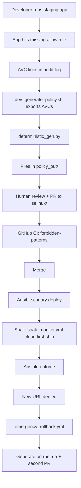

# 201 — Code walkthrough

This guide answers: **“What files are in this project, and how do they work together?”**

You do **not** need to know every script on day one. Read this in order, pause when something is new, and use the linked docs for deeper topics.

| Your goal | Start here |
|-----------|------------|
| Understand SELinux words (domain, AVC, `.te`) | **[102](../policy/102-SELINUX_BASICS.md)** §1–7 |
| **Practice commands on a SELinux host** | **[101](101-SELINUX.md)** (then **[103](103-TRAINING_LAB.md)**) |
| See how this tool fits together | [What SELinux PaC does](#what-selinux-pac-does-in-plain-english) → [Story of one policy change](#story-of-one-policy-change) |
| Find a folder or file | [Directory map](#directory-map-what-each-folder-is-for) |
| Three-app customer talk | **[202](202-DEMO_GUIDE.md)** — finish **101** first |
| Deploy to real servers | **[203](../admin/203-RHEL_TWO_HOST.md)** then **[302](../admin/302-PRODUCTION_READINESS.md)** |

**Time:** about 30–45 minutes if you read the basics doc first; 60+ minutes if you read both cover to cover.

**Doc map:** [docs/README.md](../README.md) — reading order for all guides.

---

## Where to run commands (read this once)

| Environment | When to use it | Typical commands from this guide |
|-------------|----------------|----------------------------------|
| **Repo root on any OS** | Offline tests, Python CLI, reading git | `make check`, `python3 cli/deterministic_gen.py --explain …` |
| **RHEL two-host lab** | Default: QA + prod boxes | `bash scripts/setup_rhel_hosts.sh write …` — [203-RHEL_TWO_HOST.md](../admin/203-RHEL_TWO_HOST.md) |
| **Native Linux with SELinux** (RHEL **QA**) | Staging, demo, soak, `semanage` | `sudo bash scripts/demo_bootstrap.sh --shopapi-only`, `curl 127.0.0.1:8091/health` |
| **RHEL prod** | Ansible deploy lifecycle | Playbooks with `-i ansible/inventory.production.yml` |

macOS has no SELinux — [203-RHEL_TWO_HOST.md](../admin/203-RHEL_TWO_HOST.md) then SSH to **rhel-qa**.

**Repo root** = directory containing `scripts/` and `docs/` (after `git clone`).

---

## Words you will see in this repo

If any term is fuzzy, open [102-SELINUX_BASICS.md](../policy/102-SELINUX_BASICS.md). Quick reminders:

| Term | Plain English |
|------|----------------|
| **Policy** | Rules that say which labeled process may touch which labeled files, ports, etc. |
| **`.te` file** | Text file with **allow** rules and types (Type Enforcement). |
| **`.fc` file** | Maps paths like `/var/lib/myapp` to file **types** so `restorecon` labels disks correctly. |
| **`.pp` file** | Compiled policy **module** you install with `semodule -i`. |
| **AVC** | A log line: “this process tried to do X and policy said no.” |
| **Domain** | The SELinux type of a **running** process (e.g. `myapp_t`). |
| **Manifest** | YAML file listing app name, paths, HTTP test URLs, and domains — so scripts do not hardcode `myapp`. |
| **semanage** | Linux admin tool that changes SELinux’s **live** settings (per-domain permissive, port labels, booleans) — see [102-SELINUX_BASICS.md §7](../policy/102-SELINUX_BASICS.md) |
| **`policy_out/`** | Local scratch folder for generated files (not committed to git). |
| **`selinux/`** | The **real** policy source your team reviews in pull requests. |

---

## What SELinux PaC does in plain English

**SELinux PaC** is the admin + developer tool that ships SELinux policy the same way you ship the application:

1. A **reference app** runs on a Linux host with SELinux on. The customer talk uses Tomcat App A/B plus Spring Boot `demo/shopapi/` (swap in your service). Offline `make check` classifies golden AVCs against `selinux/myapp.te` — it does not start an app.
2. While the app domain is **permissive**, the kernel **logs** denials (AVCs) instead of blocking everything.
3. Scripts **collect** those logs and **generate** updates to `.te` / `.fc` (deterministic engine; optional LLM summary).
4. **CI** checks forbidden patterns and version consistency (generator already ran the same forbidden-pattern script). Compile and semantics run on **rhel-qa**.
5. **Ansible Automation Platform (AAP)** deploys a new module (**Release canary**), runs **Soak monitor** (net-new vs installed policy), then **Promote to enforce**. A denial after ship is a **PR**, not a live host patch ([303-DENIAL_RESPONSE.md](../admin/303-DENIAL_RESPONSE.md)).

You are not expected to memorize every bash script. Most days you touch **`selinux/`**, **`config/*.manifest.yml`**, **`scripts/dev_generate_policy.sh`**, and AAP.

---

## Story of one policy change

Follow this narrative once; later sections add file names and detail.

**Step by step:**

1. **Staging** — `scripts/demo_bootstrap.sh --shopapi-only` installs Spring Boot and puts `shopapi_t` in permissive mode so you can collect denials safely.
2. **Trigger the app** — curl first-ship `/health` `/state` `/log` on :8091. See [102-SELINUX_BASICS.md §9](../policy/102-SELINUX_BASICS.md) for the mapping.
3. **Export AVCs** — `scripts/dev_generate_policy.sh --app shopapi` calls `lib/avc_query.sh` with paths and domains from **`config/shopapi.manifest.yml`**.
4. **Generate policy** — Default engine is **`cli/deterministic_gen.py`** (offline, rule-based). Optional: **`cli/summarize_pr.py`** polishes `pr_summary.md` only. Legacy all-in-one LLM: **`cli/selinux_gen.py --legacy-full-policy`**.
5. **Review** — Output lands in **`policy_out/`** (`.te`, `.fc`, `pr_summary.md`, `findings.json`). You compare to **`selinux/`** and open a PR.
6. **CI** — Workflow **`selinux-policy-ci.yml`** runs `forbidden-patterns` and `version-consistency`. The generator already ran the same forbidden-pattern check, so these jobs should pass.
7. **Deploy** — Admins use **AAP** ([`ansible/aap/`](../../ansible/aap/)): workflow **Release canary**, daily **Soak monitor**, then **Promote to enforce**. Soak fail: [303-DENIAL_RESPONSE.md](../admin/303-DENIAL_RESPONSE.md). See [301-ANSIBLE_OPERATIONS.md](../admin/301-ANSIBLE_OPERATIONS.md).

**Golden rule:** committed policy lives in **`selinux/`**. **`policy_out/`** is disposable local output.

---

## Directory map — what each folder is for

Think of the repo in **layers**: app → policy source → generators → automation → deploy.

| Path | Beginner description |
|------|----------------------|
| [`demo/shopapi/`](../../demo/shopapi/) | Spring Boot **demo** JVM. Policy seed: **`selinux/shopapi/`**. |
| [`selinux/`](../../selinux/) | **`myapp.te`** (offline generator golden), **`shopapi/`** (demo generate target), **`payments/`** (CI multi-module). |
| [`config/`](../../config/) | **`shopapi.manifest.yml`** (demo), **`myapp.manifest.yml`** (generator fixture). |
| [`cli/`](../../cli/) | Python tools: read AVC logs, classify denials, write policy snippets, soak net-new. |
| [`scripts/`](../../scripts/) | Bash entry points: two-host setup, compile, demo, soak checks. |
| [`scripts/lib/`](../../scripts/lib/) | Shared code **sourced** by other scripts (not usually run alone). |
| [`ansible/`](../../ansible/) | Playbooks that install `.pp`, soak monitor, enforce, rollback (role **`selinux_pac`**). |
| [`packaging/`](../../packaging/) | RPM specs (`selinux-policy-ops`, `<app>-selinux`) and compile container. |
| [`docs/`](../) | Guides (`admin/`, `developers/`, `policy/`, `training/`). |
| [`policy_out/`](../../policy_out/) | Generated output on your machine (gitignored). |
| [`.github/workflows/`](../../.github/workflows/) | PR CI: `forbidden-patterns` + `version-consistency`. Ship is AAP / Mac ansible-playbook. |
| [`tests/fixtures/`](../../tests/fixtures/) | Small policy snippets used to test the blast-radius classifier in CI. |

---

## Application layer (`demo/shopapi/`)

**Why `demo/shopapi/` exists:** that is the live generate target (Spring Boot, `SELinuxContext=shopapi_t`, first-ship `/health` `/state` `/log`, outage `/feature-spool`).

| File | What it does (simply) |
|------|------------------------|
| **`demo/shopapi/`** | JVM on port **8091** (from `config/shopapi.manifest.yml`). |
| **`demo/shopapi/shopapi.service`** | systemd unit with `SELinuxContext=shopapi_t` and a private JRE launcher. |

**Why three first-ship HTTP paths?** `/health` (bind), `/state` (var_lib), `/log` (logs). When policy is incomplete, you get an AVC that points to the **missing allow rule**. **Deploy gates** use [`scripts/wait_for_endpoints.sh`](../../scripts/wait_for_endpoints.sh) to curl those paths and confirm the process still runs as the right **domain**.

---

## Policy source (`selinux/`)

| File | What it is |
|------|------------|
| **`myapp.te`** | Human-readable rules: types, `allow` lines, and reusable **macros** from refpolicy. |
| **`myapp.fc`** | “This path on disk should have type X.” Used by `restorecon`. |
| **`policy_version.txt`** | Version number (must match the `policy_module(myapp, …)` line in `.te`; CI checks this). |
| **`payments/`** | Example second application module (see [206-ONBOARDING.md](../developers/206-ONBOARDING.md)). |

**Review tip:** prefer **interface macros** (shared refpolicy helpers) over one-off allows copied from `audit2allow`. That matches what [`scripts/validate_forbidden_patterns.sh`](../../scripts/validate_forbidden_patterns.sh) enforces in CI.

---

## Config and manifests (`config/`)

**Problem manifests solve:** scripts used to assume every app was named `myapp` and lived under `/opt/myapp`. That caused **wrong AVC filters** for other apps.

| File | Role |
|------|------|
| **`myapp.manifest.yml`** | Offline generator fixture: paths, domains (deterministic goldens). |
| **`payments.manifest.example.yml`** | Template for a second app. |
| **`README.md`** | Field descriptions. |

**Loader:** [`scripts/lib/app_manifest.py`](../../scripts/lib/app_manifest.py)

- **`validate`** — checks required YAML keys.
- **`shell-export`** — prints variables bash scripts can `eval` (domains, path list for AVC filtering, HTTP port, etc.).
- **`resolve`** — finds manifest from `APP_MANIFEST` or `POLICY_APP`.

Scripts like **`monitor_avc.sh`** and **`export_app_avcs_to_file`** in **`lib/avc_query.sh`** require manifest-derived paths — they **fail loudly** if paths are missing instead of silently using myapp defaults.

---

## Python CLI (`cli/`) — turning AVC logs into policy edits

Two engines share the same **first steps**: read the log, merge duplicate lines, subtract permissions already in `.te`.

### Shared preprocessing — `avc_preprocess.py`

| Step | Plain English |
|------|----------------|
| Parse AVC lines | Extract who tried what (source type, target type, permission class). |
| Merge | Combine duplicate lines into one row with all permissions. |
| Subtract existing | Drop permissions already allowed in current `myapp.te`. |
| **Net-new** | What is left is what generation must address. |

### Default: `deterministic_gen.py` (offline)

No API key. For each net-new denial it assigns a **verdict** (fix file labeling, use a boolean, add a safe allow via sepolgen, refuse dangerous allows, etc.) and writes:

- Updated **`policy_out/myapp.te`** / **`.fc`**
- **`findings.json`** — machine-readable record of each decision
- **`pr_summary.md`** — text for humans

Run golden tests: **`bash scripts/run_deterministic_fixtures.sh`**. Payments must not leak `myapp` strings: **`bash scripts/run_deterministic_payments_check.sh`**.

Details: [204-DETERMINISTIC_POLICY.md](../developers/204-DETERMINISTIC_POLICY.md).

### Optional: `selinux_gen.py` (LLM)

Same AVC preprocessing, then sends a structured prompt (`prompt_templates.py`) to an OpenAI-compatible API. Requires **`OPENAI_API_KEY`**. Still runs validation similar to CI.

### Other CLI modules (short)

| Module | Role |
|--------|------|
| **`fc_labeling.py`** | Detect labeling drift vs new `.fc` lines. |
| **`policy_rules.py`** | Shared forbidden-target lists, `NEEDS_REVIEW_RULES`, and verdict constants. |
| **`verify_avc_coverage.py`** | Checks generated policy covers the exported AVC set (PR/candidate `.te`). |
| **`soak_net_new.py`** | Soak: net-new needs vs **installed** policy (`sesearch`), JSON exceptions. |
| **`boolean_hints.yml`** (in `config/`) | Curated hints when a **setsebool** is the right fix. |

---

## Shell scripts (`scripts/`) — what to run when

Most scripts expect your shell’s **current directory** to be the **repo root** unless the doc says otherwise. Staging and demo scripts need **RHEL + SELinux** (dev box). Compile natively with `selinux-policy-devel` on RHEL.

### Day-to-day developer commands

| Script | When you use it |
|--------|------------------|
| **`dev_generate_policy.sh`** | Main command: vendor-policy pre-flight → export AVCs → generate → diff → optional copy into `selinux/`. `--tune-report` for vendor-covered apps (commands only). `--force "reason"` only if the app genuinely differs. |
| **`selinux_pac_adopt.sh`** | `doctor` + `init APP` — print manifest and **Ansible** next steps. |
| **`setup_rhel_hosts.sh`** | Write `inventory.dev.yml` / `inventory.production.yml`; ping; doctor; bootstrap hints. |
| **`demo_present.sh`** | Customer talk: Act 0 triage, App A (vendor, already enforcing), App B (tune, no `.te`), shopapi generate. `--profile customer\|technical`, `--preflight`, `--dry-run`. |
| **`demo_bootstrap.sh`** / **`make demo-bootstrap`** | Idempotent three-app estate on RHEL. JWS if the repo is reachable, else distro Tomcat + `tomcat_t`. |
| **`demo_e2e_mac.sh`** / **`demo_e2e_rhel_qa.sh`** / **`demo_e2e_rhel_prod.sh`** | Two-host **shopapi** pipeline (technical Act 5): generate → PR on `selinux/shopapi/` → clean soak → enforce; `/feature-spool` fails on prod; admin rollback. |
| **`reset_demo_vms.sh`** | Between rehearsals: unload leftover `shopapi` modules and prod RPMs. JVM stays. Then start the Mac conductor. Not `reset_host_state.yml`. |
| **`demo_open_generated_pr.sh`** | Open a GitHub PR from live generated `selinux/` (Mac, after scp from rhel-qa). |
| **`assemble_pr_body.sh`** | Builds GitHub PR description from template + summary + optional rule diff. |
| **`compile_and_validate.sh`** | Compile `.te`/`.fc` to `.pp` and run basic checks. |

**Environment tips:**

- **`POLICY_ENGINE=deterministic`** (default) or **`llm`**
- **`APP_MANIFEST`** / **`POLICY_APP`** — pick which manifest drives paths and names
### Safety gates (soak and production)

| Script | Plain English |
|--------|----------------|
| **`monitor_avc.sh`** | Soak report: raw AVC count **and** net-new vs installed policy (`--max-net-new`). Needs **`--manifest`**. |
| **`check_soak_ready.sh`** | Manual host CLI: days elapsed, AVC/net-new, deploy report. Ansible uses **`collect_soak_facts.sh`**. |
| **`collect_soak_facts.sh`** | JSON facts for Ansible (`avc_net_new_count`, `avc_fail_closed`). |
| **`post_deploy_report.sh`** | Writes deploy report JSON after endpoints are exercised. |
| **`verify_file_contexts.sh`** | Compare on-disk labels to `.fc` before restart. |

### Compile toolchain

| Script / lib | Role |
|--------------|------|
| **`lib/compile_policy.sh`** | Compile module with `selinux-policy-devel` (`make -f /usr/share/selinux/devel/Makefile`). |
| **`compile_and_validate.sh`** | Forbidden-pattern check + compile. |
| **`ci/install_rhel_policy_tools.sh`** | `dnf install` devel + setools on a RHEL/Stream box (optional; not a GitHub job). |

### CI-heavy scripts (you may read, rarely run locally)

| Script | Why it exists |
|--------|----------------|
| **`validate_forbidden_patterns.sh`** | Block wildcards and risky allows in `.te`. |
| **`validate_policy_semantics.sh`** | After compile, probe policy in an isolated store (e.g. no shadow read). |
| **`validate_version_consistency.sh`** | Version file matches `.te` and packaging. |
| **`classify_policy_blast_radius.sh`** | Suggest soak length from how risky new allows are. |
| **`lib/policy_module_diff.sh`** | Markdown diff of allow rules between two module versions (for PR comments). |
| **`smoke_test.py`** | Fast regression suite on Ubuntu CI. |
| **`run_e2e_tests.sh`** | Broader integration driver. |

### Demo helpers

| Script | Role |
|--------|------|
| **`demo_present.sh`** | Three-app customer talk (`--profile customer\|technical`, `--dry-run`, `--preflight`). |
| **`demo_bootstrap.sh`** | Idempotent App A/B + shopapi estate (`make demo-bootstrap`). |
| **`demo_e2e_mac.sh`**, **`demo_e2e_rhel_qa.sh`**, **`demo_e2e_rhel_prod.sh`** | Two-host pipeline of [203-RHEL_TWO_HOST.md](../admin/203-RHEL_TWO_HOST.md). |
| **`reset_demo_vms.sh`** | Wipe leftover shopapi policy on both VMs (Mac). JVM stays. |
| **`demo_open_generated_pr.sh`** | Live generate → GitHub PR (needs `gh`). |

---

## Ansible (`ansible/`)

Playbooks are short; behavior lives in the **`selinux_pac`** role (manifest-driven ports and units).

| Playbook | Phase |
|----------|--------|
| **`deploy_canary.yml`** | Install module, permissive domain, smoke endpoints, start soak clock. |
| **`soak_monitor.yml`** | Daily / on-demand: fail if net-new exceeds threshold. Talk: first-ship only so this **passes**. |
| **`soak_status.yml`** | Read-only soak facts before enforce. |
| **`enforce_production.yml`** | Soak gates passed → enforcing mode. |
| **`emergency_rollback.yml`** | Break-glass rollback steps. |
| **`reset_host_state.yml`** | Interrupted canary: `semodule -B` + clear permissive. Module stays. Demo wipe is `reset_demo_vms.sh`. |

**Canary (simplified):** load manifest → validate artifact → optional `semodule -DB` → register **`selinux_ports`** → permissive domain → install `.pp` → `restorecon` → restart services → write marker + report.

**Enforce (simplified):** `collect_soak_facts` (prefer **net-new**) → remove permissive → rebuild policy store → smoke again.

Inventory examples: **`inventory.dev.example.yml`** (RHEL dev), **`inventory.production.example.yml`** (RHEL prod). Generate with **`scripts/setup_rhel_hosts.sh`**. AAP objects: [`ansible/aap/`](../../ansible/aap/) and [301-ANSIBLE_OPERATIONS.md](../admin/301-ANSIBLE_OPERATIONS.md). Denial after ship: [303-DENIAL_RESPONSE.md](../admin/303-DENIAL_RESPONSE.md). Two-host walkthrough: [203-RHEL_TWO_HOST.md](../admin/203-RHEL_TWO_HOST.md).

---

## Packaging (`packaging/`)

| Artifact | Purpose |
|----------|---------|
| **`myapp-selinux.spec`** | Test-fixture RPM for the offline `myapp` generator module. |
| **`shopapi-selinux.spec`** | Demo RPM: compiled `shopapi.pp` + `/etc/shopapi/selinux-manifest.yml`. |
| **`selinux-policy-ops.spec`** | RPM of operational scripts (`monitor_avc.sh`, `soak_net_new.py`, `collect_soak_facts.sh`, …) at `/usr/libexec/selinux-policy-ops`. |

---

## GitHub review (no Actions in the paced lab)

The two-host talk track opens a **GitHub PR** with `scripts/demo_open_generated_pr.sh` so CODEOWNERS can review `selinux/shopapi/`. GitHub Actions workflows are not part of that demo.

PR checklist template: [`.github/PULL_REQUEST_TEMPLATE/selinux_policy_review.md`](../../.github/PULL_REQUEST_TEMPLATE/selinux_policy_review.md).

---

## Tests (`tests/`)

**Blast-radius fixtures** under **`tests/fixtures/blast_radius/`** — tiny `.te` changes with expected JSON (tier, soak days, fail-closed). CI ensures the classifier does not silently shorten soak time on errors.

**Deterministic golden AVCs** live under **`docs/examples/fixtures/deterministic/`** (contiguous **`01`–`13`**; every verdict type has at least one case).

---

## Suggested path for new contributors

1. Type **[101](101-SELINUX.md)** on a SELinux VM (**[102](../policy/102-SELINUX_BASICS.md)** §1–4 if labels are fuzzy).
2. Watch **[202](202-DEMO_GUIDE.md)**.
3. Skim [README.md](../../README.md) architecture diagram.
4. Open **`config/shopapi.manifest.yml`** and **`demo/shopapi/`** — match each first-ship path to a permission story. Generator goldens live in **`selinux/myapp.te`**.
5. Trace one AVC through **`cli/avc_preprocess.py`**, then try **`bash scripts/dev_generate_policy.sh --skip-export`** with a saved **`policy_out/avc.log`**.
6. When ready for ops: **[301](../admin/301-ANSIBLE_OPERATIONS.md)** + **[303](../admin/303-DENIAL_RESPONSE.md)** + **[302](../admin/302-PRODUCTION_READINESS.md)**.

---

## Quick reference — algorithms in one line each

| Idea | One-line explanation |
|------|----------------------|
| AVC merge | Group log lines by source + target + class; union permissions. |
| Net-new | Permissions in AVC minus permissions already in `.te`. |
| Policy diff for PRs | Compile old and new module → compare `sesearch` allow lines. |
| Blast radius | Classify each **new** allow as low/medium/high risk → suggested soak days; errors → stay strict (7 days). |
| Soak gate | Enough days since canary + **zero net-new access needs** vs installed policy (raw AVC fallback if `sesearch` missing) + deploy report OK. |
| Version SSOT | `policy_version.txt` must match `policy_module()` in `.te`. |
| Manifest identity | App name, domains, and AVC path filters come from YAML — not silent `myapp` defaults. |

---

## Other docs in `docs/`

Numbered catalog: [docs/README.md](../README.md).

| # | Guide | Best for |
|---|--------|----------|
| **101** | [SELinux 101](101-SELINUX.md) | Typed shopapi labs before the talk |
| **102** | [SELinux basics](../policy/102-SELINUX_BASICS.md) | First-time SELinux readers |
| **103** | [Hands-on recap](103-TRAINING_LAB.md) | After 101: recap + `demo_present.sh` |
| **202** | [Three-app customer talk](202-DEMO_GUIDE.md) | `demo_present.sh` |
| **203** | [Two Linux VMs](../admin/203-RHEL_TWO_HOST.md) | QA + prod |
| **204** | [Deterministic policy](../developers/204-DETERMINISTIC_POLICY.md) | Offline generator and fixtures |
| **205** | [Testing](../developers/205-TESTING.md) | PR CI and local `make check` |
| **206** | [Onboarding](../developers/206-ONBOARDING.md) | Adding `payments` or your own app |
| **207** | [Best practices](../policy/207-SELINUX_BEST_PRACTICES.md) | What CI accepts |
| **301** | [Ansible operations](../admin/301-ANSIBLE_OPERATIONS.md) | AAP / playbooks |
| **302** | [Production readiness](../admin/302-PRODUCTION_READINESS.md) | Canary → enforce |
| **303** | [Denial response](../admin/303-DENIAL_RESPONSE.md) | Prod AVC → PR |
| **304** | [Adoption checklist](../admin/304-ADOPTION_CHECKLIST.md) | Fork/org wiring |

If this guide disagrees with the code, **trust the repository** and send a PR to update the doc.
